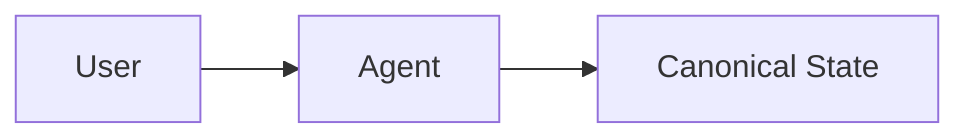
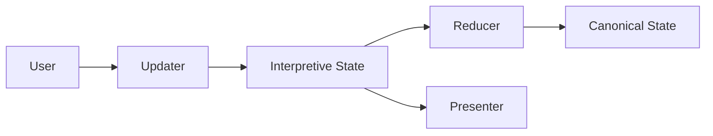

# Interpretive State

## Definition and Motivation

### Problem Statement: Limitations of Canonical-Only State Design

In conventional agentic application workflows, the system is typically designed around a **business-domain model** that represents the final artifact required by downstream processes. This model defines a fixed structure with a set of required fields, validation rules, and dependencies. The goal of the conversation is to progressively populate this structure until it is complete and valid.

This business-domain structure is commonly treated as the **Canonical State**. Conversation logic is then organized around filling the fields of this state, one by one, in an order that aligns with backend requirements. The implicit assumption is that successful interaction corresponds to gradually completing the Canonical State through dialogue.

In its simplest form, the conventional architecture can be illustrated as follows:

In this model, the Canonical State serves both as the authoritative business representation and as the primary interaction state.

In many agentic applications and workflows, the primary goal of conversation is to **produce a structured artifact** that feeds a downstream business process, such as creating an event for registration, submitting a tax return, configuring a service, or completing an onboarding flow. In these systems, conversation is treated as a means to an end: collecting the required data to satisfy a predefined business schema. We refer to this finalized, validated, and business-facing artifact as the **Canonical State**.

As systems grow more capable, two related challenges emerge if the overall interaction architecture is not carefully designed.

First, as the underlying state structure becomes more complex or as conversation sessions become longer, it becomes increasingly difficult for canonical-only designs to correctly handle **order-independent field input**, **ambiguity**, **revisions**, and **partial intent**. Even when not explicitly intended, systems may struggle to retain and reason over information provided out of order, or to reconcile multiple evolving interpretations without prematurely committing or discarding data.

Second, modern applications are often expected to support more effective interaction patterns beyond plain text, including **generative and interactive UI components**, as well as robust evaluation and inspection of agent behavior. Supporting these requirements directly on top of a rigid canonical schema significantly increases design complexity, leading to tangled control logic and brittle edge-case handling.

Taken together, these challenges motivate the introduction of an additional interaction layer: the **Interpretive State**, allowing flexible conversation, richer UI modalities, and observable intermediate reasoning before information is finalized into Canonical State.tate.

### Definition and Motivation

**Interpretive State** is an interaction-first state model that is mapped or reduced into the Canonical State through a reducer. It is introduced as an extension layer around the Canonical State to support language-driven interaction, ambiguity, partial information, and UI-level affordances that cannot be cleanly represented in a strict business schema.

The Canonical State remains minimal, validated, and authoritative. Interpretive State exists to capture everything *before* that point: how information is expressed, inferred, constrained, negotiated, and presented during interaction. This separation is intentional and foundational.

Interpretive State is introduced to:

* enable natural, flexible user interaction without forcing premature structure
* support UI modalities beyond plain text
* allow fine-grained logical control and inspection of state evolution
* reduce token usage and improve evaluation through structured state management

---

## 1. Supporting Natural Conversation

Interpretive State supports natural conversation by allowing **object-level reasoning**, **ambiguity**, and **non-linear field acquisition**.

Users are not required to follow a predefined order when providing information. Partial, ambiguous, or out-of-order inputs are captured safely without committing to the Canonical State.

### Example: Linear vs Interpretive Interaction

**Canonical-first (rigid)**

* System: "Please provide your email."
* User: "I want to bring my wife and two guests this Saturday."
* System: "Please provide your email first." (information ignored)

**Interpretive State (flexible)**

* User: "I want to bring my wife and two guests this Saturday."
* Interpretive State captures:

  * guests = [wife, guest1, guest2]
  * date = Saturday (unconfirmed)
* System: "Before I register your guests, please verify your email."

The key difference is that Interpretive State **retains meaning without enforcing order**, enabling smoother, more human-like interaction.

---

## 2. Supporting Generative UI

Text-only conversation is not always the most effective interaction mode. In many applications, **interactive UI components**—such as dropdowns, multi-select lists, and form elements—significantly improve readability, efficiency, and correctness.

Interpretive State explicitly supports this by allowing **UI-oriented fields and properties** that do not belong in Canonical State.

### Example: Event Selection

Instead of asking:

> "Please type the event name."

Interpretive State may hold:

* event_candidates: [Event A, Event B, Event C]
* selection_mode: single-select
* validation_rule: required

This allows the Presenter to render:

* a dropdown list
* selectable cards
* or other interactive components

The UI is generated directly from Interpretive State, while Canonical State only receives the final selected event.

---

## 3. Granular Logical Control

Interpretive State enables **fine-grained logical control** over interaction and decision-making.

This includes:

* turn-level state diffs (what changed, when, and why)
* constraint evaluation (met, pending, violated)
* gated transitions (blocking or allowing progress)
* safe handling of partial or invalid updates

By making these elements explicit in state, the system avoids hidden logic embedded in prompts or ad-hoc code paths.

---

## 4. Token Efficiency and Evaluation via SUP

Interpretive State works in conjunction with the **SUP (State–Updater–Presenter) pattern** to improve both runtime efficiency and evaluation quality.

By externalizing interaction state:

* prior context does not need to be repeatedly re-described to the LLM
* token usage is reduced across multi-turn workflows
* state transitions can be replayed, inspected, and evaluated without re-running full conversations

The SUP pattern provides the structural framework, while Interpretive State provides the concrete substrate for efficient, testable interaction.

---

## Summary

Interpretive State serves as the bridge between free-form human interaction and strict business logic. By separating interpretation from commitment, it enables more natural conversations, richer UI experiences, stronger logical control, and more efficient and observable AI systems.
