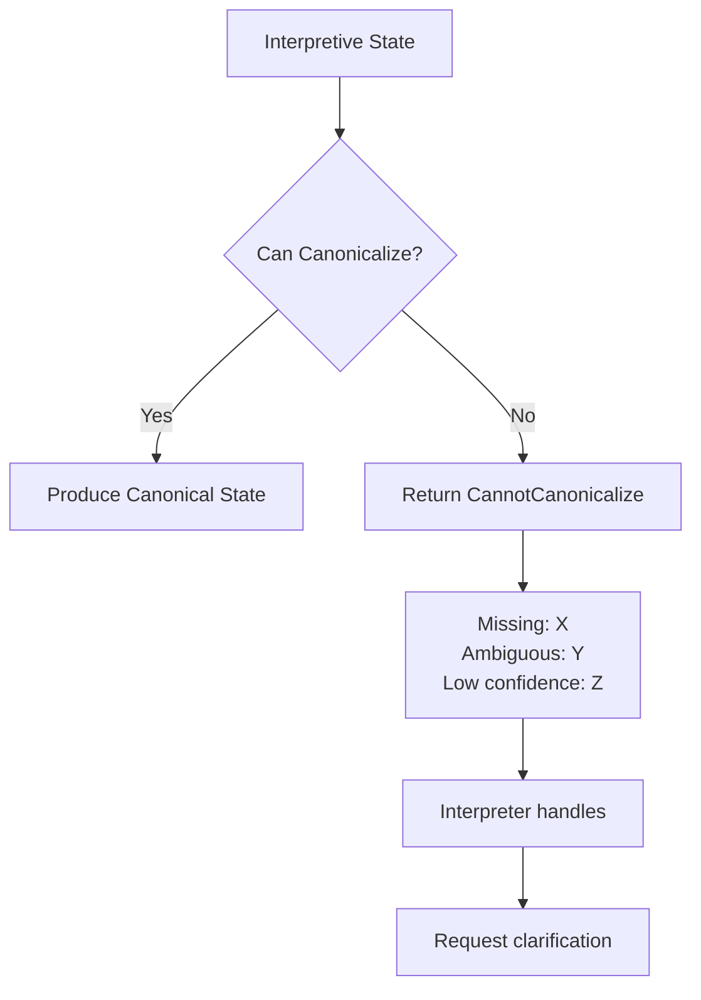

The **Canonicalizer** is the component responsible for transforming interpretive state into canonical state. It sits at the commitment boundary, ensuring that only validated, complete state enters the execution layer.

## Role and Responsibility

The Canonicalizer has a focused set of responsibilities:

<CardGroup cols={2}>
  <Card title="Value Selection" icon="hand-pointer">
    Choose final values from candidates, tentatives, and alternatives
  </Card>
  <Card title="Reference Resolution" icon="link">
    Convert human-readable values to system identifiers
  </Card>
  <Card title="Validation" icon="shield-check">
    Ensure output satisfies canonical schema constraints
  </Card>
  <Card title="Formatting" icon="file-code">
    Transform to required canonical structure
  </Card>
</CardGroup>

The Canonicalizer does **not**:
- Make decisions about user intent
- Generate responses or UI
- Execute business logic
- Modify interpretive state

## Reduction Strategies

Different reduction strategies suit different scenarios:

### Deterministic Reduction

For fields with clear selection rules:

```python
def reduce_deterministic(interpretive_state):
    canonical = {}
    
    # Direct mapping for confirmed values
    if interpretive_state.date.status == "confirmed":
        canonical["date"] = interpretive_state.date.value
    
    # Selection from candidates
    if len(interpretive_state.venue.candidates) == 1:
        canonical["venue_id"] = interpretive_state.venue.candidates[0].id
    elif interpretive_state.venue.selected:
        canonical["venue_id"] = interpretive_state.venue.selected
    
    return canonical
```

**Best for**: Fields with explicit user confirmation, single candidates, or clear business defaults.

### LLM-Assisted Reduction

For fields requiring interpretation:

```python
def reduce_with_llm(interpretive_state, context):
    prompt = f"""
    Given the following interpretive state, determine the canonical value.
    
    Field: preferred_time
    Candidates: {interpretive_state.time.candidates}
    User statements: {context.relevant_statements}
    
    Select the most likely intended time and explain your reasoning.
    """
    
    result = llm.complete(prompt)
    return result.selected_value, result.confidence
```

**Best for**: Ambiguous preferences, implicit intent, context-dependent choices.

### Hybrid Reduction

Combine strategies based on field characteristics:

```python
def reduce_hybrid(interpretive_state):
    canonical = {}
    
    # Deterministic for high-confidence fields
    for field in interpretive_state.confirmed_fields:
        canonical[field.name] = field.value
    
    # LLM-assisted for ambiguous fields
    for field in interpretive_state.ambiguous_fields:
        if field.requires_interpretation:
            canonical[field.name] = llm_reduce(field)
        else:
            canonical[field.name] = apply_default_rule(field)
    
    return canonical
```

## Guarantees and Constraints

The Canonicalizer provides several guarantees:

### Output Guarantees

| Guarantee | Description |
|-----------|-------------|
| **Schema Compliance** | Output always matches canonical schema |
| **Completeness** | All required fields present or error raised |
| **Validity** | All values pass validation rules |
| **Determinism** | Same interpretive state produces same canonical state (for deterministic strategy) |

### Input Constraints

The Canonicalizer requires:

```python
class CanonicalizerInput:
    def validate(self, interpretive_state):
        # Required fields must have values
        for field in self.required_fields:
            if not interpretive_state.has_value(field):
                raise CannotCanonicalize(f"Missing required: {field}")
        
        # Confidence thresholds must be met
        for field in interpretive_state.fields:
            if field.confidence < self.min_confidence:
                raise CannotCanonicalize(f"Low confidence: {field}")
        
        # No blocking ambiguities
        if interpretive_state.has_blocking_ambiguity():
            raise CannotCanonicalize("Unresolved ambiguity")
```

### Error Handling

When canonicalization cannot proceed:



## Implementation Example

```python
class Canonicalizer:
    def __init__(self, schema, strategy="hybrid"):
        self.schema = schema
        self.strategy = strategy
    
    def can_canonicalize(self, interpretive_state) -> tuple[bool, list[str]]:
        """Check if state is ready for canonicalization."""
        blockers = []
        
        for field in self.schema.required:
            state_field = interpretive_state.get(field)
            if not state_field:
                blockers.append(f"missing:{field}")
            elif state_field.status == "ambiguous":
                blockers.append(f"ambiguous:{field}")
            elif state_field.confidence < 0.8:
                blockers.append(f"low_confidence:{field}")
        
        return len(blockers) == 0, blockers
    
    def canonicalize(self, interpretive_state) -> dict:
        """Transform interpretive state to canonical state."""
        can_proceed, blockers = self.can_canonicalize(interpretive_state)
        if not can_proceed:
            raise CannotCanonicalize(blockers)
        
        canonical = {}
        
        for field in self.schema.fields:
            interp_field = interpretive_state.get(field.name)
            canonical[field.name] = self._reduce_field(interp_field, field)
        
        # Final validation
        self.schema.validate(canonical)
        
        return canonical
    
    def _reduce_field(self, interp_field, schema_field):
        """Reduce a single field based on strategy."""
        if self.strategy == "deterministic":
            return interp_field.value
        elif self.strategy == "llm":
            return self._llm_reduce(interp_field)
        else:  # hybrid
            if interp_field.status == "confirmed":
                return interp_field.value
            elif interp_field.requires_interpretation:
                return self._llm_reduce(interp_field)
            else:
                return interp_field.value or schema_field.default
```

## Configuration

The Canonicalizer accepts configuration for its behavior:

```yaml
canonicalizer:
  strategy: hybrid
  confidence_threshold: 0.8
  
  field_strategies:
    date: deterministic
    time: deterministic
    venue_preference: llm_assisted
    special_requests: llm_assisted
  
  llm:
    model: gpt-4
    temperature: 0
    max_retries: 2
  
  validation:
    strict: true
    allow_partial: false
```

## Summary

The Canonicalizer is the gatekeeper between interaction and execution:

| Aspect | Description |
|--------|-------------|
| **Input** | Ready interpretive state |
| **Output** | Valid canonical state |
| **Strategy** | Deterministic, LLM-assisted, or hybrid |
| **Guarantees** | Schema compliance, completeness, validity |
| **On Failure** | Returns blockers for interpreter to address |
