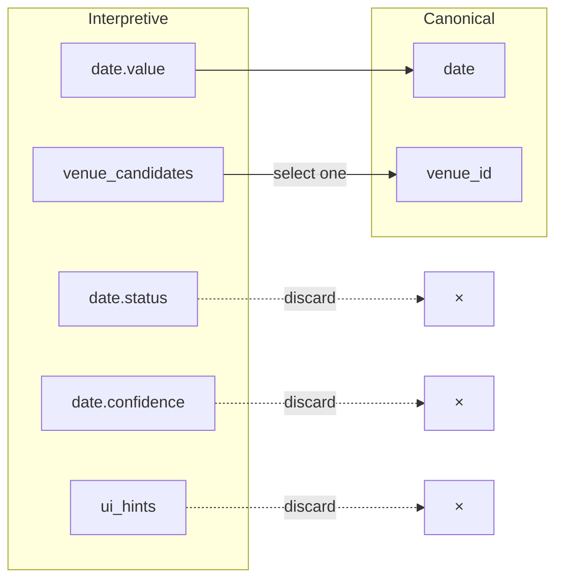

LangState recommends designing systems with the **canonical model as baseline** and **interpretive state as a superset** that extends it for interaction purposes.

## Canonical Model as Baseline

Start with the canonical model — the minimal, validated schema required by your business:

```json
{
  "$schema": "canonical-booking",
  "properties": {
    "date": { "type": "string", "format": "date" },
    "time": { "type": "string", "format": "time" },
    "guest_count": { "type": "integer", "minimum": 1 },
    "venue_id": { "type": "string" },
    "contact_email": { "type": "string", "format": "email" }
  },
  "required": ["date", "time", "guest_count", "venue_id", "contact_email"]
}
```

This schema represents the **contract** with downstream systems — APIs, databases, and business processes all expect this structure.

## Interpretive State as Superset

Interpretive state **extends** the canonical schema to support interaction:

```json
{
  "$schema": "interpretive-booking",
  "extends": "canonical-booking",
  "properties": {
    "date": {
      "allOf": [
        { "$ref": "#/canonical/date" },
        {
          "properties": {
            "status": { "enum": ["tentative", "confirmed", "ambiguous"] },
            "confidence": { "type": "number" },
            "alternatives": { "type": "array", "items": { "type": "string" } },
            "source": { "enum": ["user_explicit", "user_implicit", "inferred"] }
          }
        }
      ]
    },
    // ... similar extensions for other fields
    
    // Interaction-only fields (not in canonical)
    "venue_candidates": {
      "type": "array",
      "items": { "type": "object" }
    },
    "formation_status": {
      "type": "object",
      "properties": {
        "phase": { "enum": ["accumulating", "stabilizing", "ready"] },
        "coverage": { "type": "number" }
      }
    }
  }
}
```

## Design Guidelines for Expansion

### Guideline 1: Mirror Structure, Add Metadata

For each canonical field, create a parallel interpretive field with additional metadata:

```
Canonical:     { "date": "2024-03-15" }

Interpretive:  { 
                 "date": {
                   "value": "2024-03-15",
                   "status": "confirmed",
                   "confidence": 0.95
                 }
               }
```

### Guideline 2: Add Interaction-Only Fields

Include fields that support interaction but aren't needed in canonical state:

| Interaction Field | Purpose | Canonical Equivalent |
|-------------------|---------|---------------------|
| `venue_candidates` | Show options to user | `venue_id` (single value) |
| `date_preferences` | Track user flexibility | `date` (single value) |
| `clarification_needed` | Flag for interpreter | None |
| `ui_hints` | Drive component rendering | None |

### Guideline 3: Preserve Reducibility

Every interpretive field must either:
1. **Map to a canonical field** through clear reduction rules
2. **Be explicitly interaction-only** (discarded during canonicalization)



### Guideline 4: Define Clear Reduction Rules

Document how each interpretive field reduces:

```yaml
reduction_rules:
  date:
    source: date.value
    condition: date.status == "confirmed"
    fallback: null  # Blocks canonicalization if not confirmed
    
  venue_id:
    source: venue_candidates[selected].id
    condition: exactly one candidate selected
    fallback: venue_candidates[0].id if single candidate
    
  guest_count:
    source: guests.count.value
    condition: guests.count.confidence > 0.8
    fallback: prompt for confirmation
```

## Example: Full Schema Expansion

**Canonical Schema** (5 fields):
```json
{
  "date": "2024-03-15",
  "time": "18:00",
  "guest_count": 12,
  "venue_id": "venue_001",
  "contact_email": "user@example.com"
}
```

**Interpretive Schema** (expanded):
```json
{
  "date": {
    "value": "2024-03-15",
    "status": "confirmed",
    "confidence": 0.95,
    "source": "user_explicit",
    "turn": 2
  },
  "time": {
    "candidates": ["18:00", "19:00"],
    "preference": "18:00",
    "status": "ambiguous",
    "flexibility": "somewhat_flexible"
  },
  "guests": {
    "count": { "value": 12, "status": "confirmed" },
    "names": ["Alice", "Bob"],
    "dietary_notes": { "vegetarian": 2 }
  },
  "venue": {
    "candidates": [
      { "id": "venue_001", "name": "Grand Hall", "score": 0.9 },
      { "id": "venue_002", "name": "Garden Room", "score": 0.7 }
    ],
    "selected": "venue_001",
    "selection_reason": "user_preference"
  },
  "contact": {
    "email": { "value": "user@example.com", "verified": true },
    "phone": { "value": null, "status": "optional" }
  },
  "formation": {
    "phase": "stabilizing",
    "coverage": 0.85,
    "blocking_fields": ["time"],
    "ready_for_commit": false
  },
  "ui": {
    "show_venue_comparison": true,
    "highlight_time_selection": true
  }
}
```

## Benefits of This Approach

<CardGroup cols={2}>
  <Card title="Clear Contract" icon="file-contract">
    Canonical schema defines exact downstream expectations
  </Card>
  <Card title="Flexible Interaction" icon="comments">
    Interpretive extensions support natural conversation
  </Card>
  <Card title="Predictable Reduction" icon="compress">
    Clear rules for how interaction state becomes business state
  </Card>
  <Card title="Independent Evolution" icon="code-branch">
    Interaction schema can evolve without changing business contracts
  </Card>
</CardGroup>
