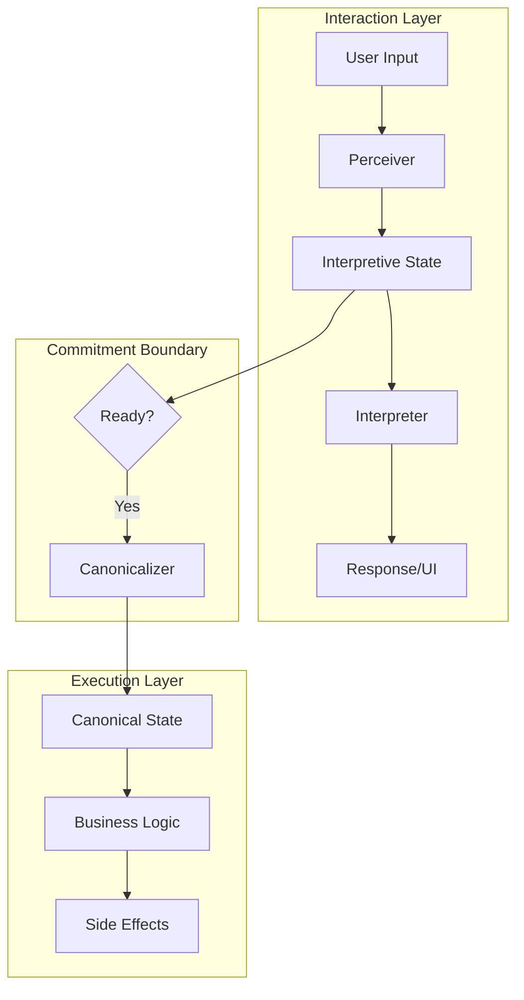
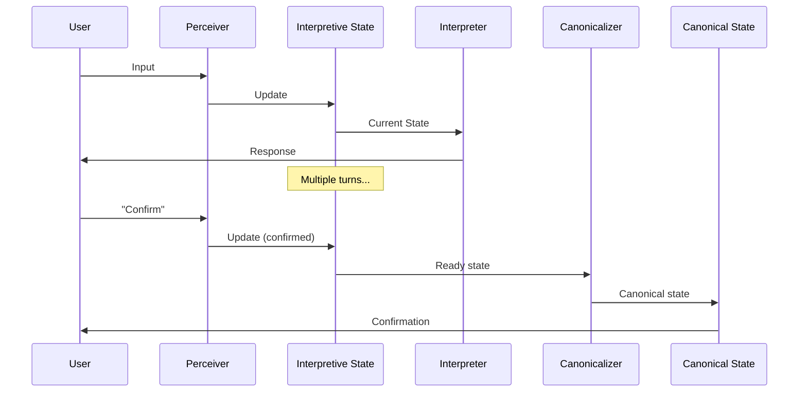
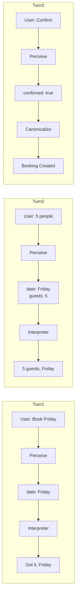

LangState organizes systems around an **interpretive-first architecture** where the interaction layer is cleanly separated from the execution layer.

## System Layout



## Layer Responsibilities

### Interaction Layer

The interaction layer handles all user-facing communication:

| Component | Responsibility |
|-----------|---------------|
| **Perceiver** | Ingests and normalizes user input from any modality |
| **Interpretive State** | Stores evolving understanding of user intent |
| **Interpreter** | Generates responses and UI based on current state |

**Key properties**:
- Tolerates ambiguity and incomplete information
- Supports revision without side effects
- Operates on interpretive state only
- Never directly executes business logic

### Execution Layer

The execution layer handles business operations:

| Component | Responsibility |
|-----------|---------------|
| **Canonicalizer** | Reduces interpretive state to canonical form |
| **Canonical State** | Validated, execution-ready business data |
| **Business Logic** | Domain operations and side effects |

**Key properties**:
- Requires complete, validated state
- Executes irreversible operations
- Operates on canonical state only
- Follows strict business rules

## Boundaries Between Layers

The architecture enforces clear boundaries:

<CardGroup cols={2}>
  <Card title="Interaction → Execution" icon="arrow-right">
    Only through Canonicalizer when state is ready
  </Card>
  <Card title="Execution → Interaction" icon="arrow-left">
    Results flow back as new input to Perceiver
  </Card>
</CardGroup>

### Why Boundaries Matter

**Without boundaries**:
```
User: "Book for Saturday"
System: ✗ Creates booking immediately
User: "Wait, I meant Sunday"
System: ✗ Must cancel and rebook
```

**With boundaries**:
```
User: "Book for Saturday"
System: Updates interpretive state
User: "Wait, I meant Sunday"
System: Updates interpretive state
User: "Yes, confirm Sunday"
System: Canonicalizes and executes
```

## Data Flow



## Component Isolation

Each component has a well-defined interface:

```
┌─────────────┐     ┌─────────────────┐     ┌─────────────┐
│  Perceiver  │────▶│ Interpretive    │────▶│ Interpreter │
│             │     │ State           │     │             │
│ in: Input   │     │                 │     │ out: Response│
│ out: Update │     │ in: Updates     │     │             │
└─────────────┘     │ out: State      │     └─────────────┘
                    └────────┬────────┘
                             │
                             ▼
                    ┌─────────────────┐     ┌─────────────┐
                    │  Canonicalizer  │────▶│  Canonical  │
                    │                 │     │  State      │
                    │ in: Interp State│     └─────────────┘
                    │ out: Canon State│
                    └─────────────────┘
```

This isolation enables:
- Independent testing of each component
- Swapping implementations without system-wide changes
- Clear contracts between components
- Parallel development across teams

## Configuration Points

The architecture exposes several configuration points:

| Point | Configuration Options |
|-------|----------------------|
| Perceiver | Input modalities, normalization rules |
| Interpretive State | Schema, confidence thresholds, field constraints |
| Interpreter | Response strategies, UI generation rules |
| Canonicalizer | Reduction strategy, validation rules |
| Commitment Boundary | When to trigger canonicalization |

## Example: Complete Flow



The interpretive-first architecture ensures that user intent is fully captured and confirmed before any irreversible actions occur.
