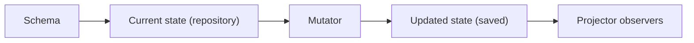

LangState is a single-state orchestrator:

- `LangState` persists one current state object in a repository
- `Mutator` updates that state from user input
- `Projectors` observe state changes and generate projections
- `Action` contracts remain available for business execution, but are intentionally decoupled from the core orchestration path

## Module structure

```text
langstate/
├── core/
│   ├── action/
│   ├── evaluator/
│   ├── mutator/
│   ├── projector/
│   │   ├── base/
│   │   ├── canonical/
│   │   └── ui/
│   ├── spec_extractor/
│   ├── state/
│   │   ├── canonical/
│   │   ├── repository/
│   │   └── snapshot/
│   └── langstate/
└── docs/
```

## Orchestrator responsibilities

`LangState` is the coordination point for:

- loading or setting the schema
- persisting the current state in a repository
- delegating updates to a mutator
- notifying projector observers after state changes
- returning either an `InteractionRequest` or final `StateResultData`

### Core methods

| Method | Purpose |
| --- | --- |
| `initialize(config)` | Set up schema and runtime components |
| `invoke(agent_input, metadata)` | Process input and return the next interaction or final result |
| `get_state()` | Read the current persisted state |
| `reset()` | Reset the flow and start over |

## State model

At the orchestrator level, LangState tracks one state ID (`state`) and one state object.

The default state payload shape is:

```python
{
    "field_key": {
        "inference": [{"content": "...", "mutator_id": "..."}],
        "values": [{"value": "...", "confidence": 0.95}]
    }
}
```

This shape is represented by `StateSchema`.

## Data flow



1. A schema is loaded or injected during initialization.
2. The current state is read from the repository.
3. A mutator transforms state from structured input.
4. LangState persists the updated state.
5. Projectors are notified and produce canonical, UI, or custom projections.

## Observer pattern

LangState uses an observer protocol:

- `LangState` acts as the subject
- projectors act as observers
- `_set_state(...)` saves the state and then calls `_notify_projectors(...)`
- projectors receive a `ProjectionContext` containing current state, conversation history, and metadata

This keeps projection behavior extensible without making the orchestrator branch on projector type.

## Contracts by module

### Mutator

- Accepts a `MutationContext`
- Returns a `MutationResult`
- Owns the logic that turns structured input into state updates

### Projector

- Accepts a `ProjectionContext`
- Returns a `ProjectionResult`
- May specialize into UI or canonical projections

### Repository

- Stores and retrieves the current `BaseState`
- Defaults to an in-memory implementation
- Can be swapped for a custom persistence layer

### Action

Action contracts exist for business execution but are intentionally outside the core orchestrator loop. That separation keeps LangState focused on state formation and projection rather than irreversible business side effects.

## Why this split matters

This architecture gives the package a clean seam between:

- state formation
- projection
- persistence
- business execution

That in turn makes the core library easier to test, easier to extend, and less likely to entangle UI behavior with mutation logic.
