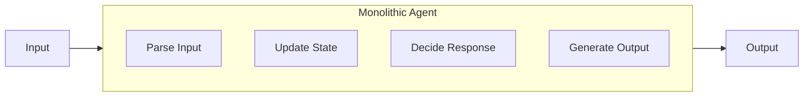
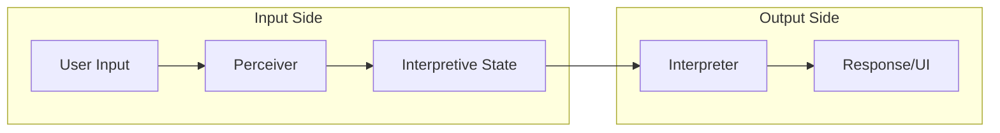
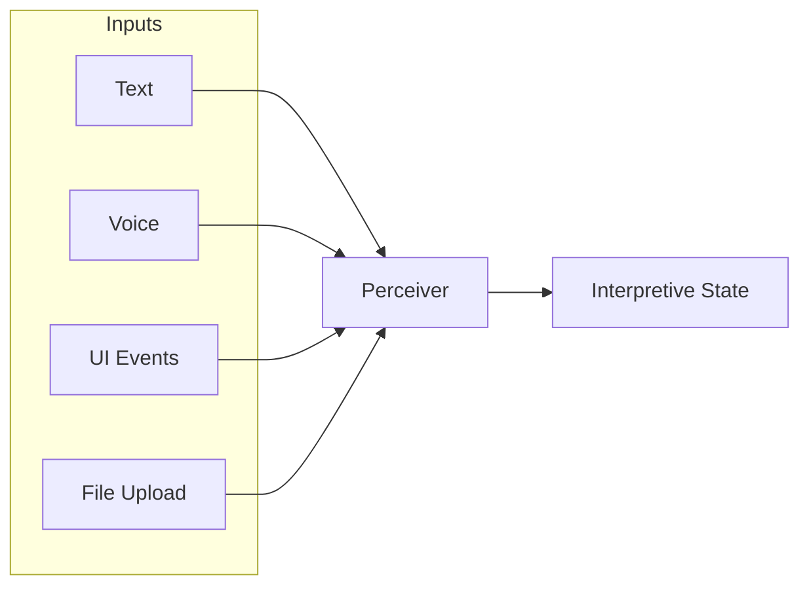
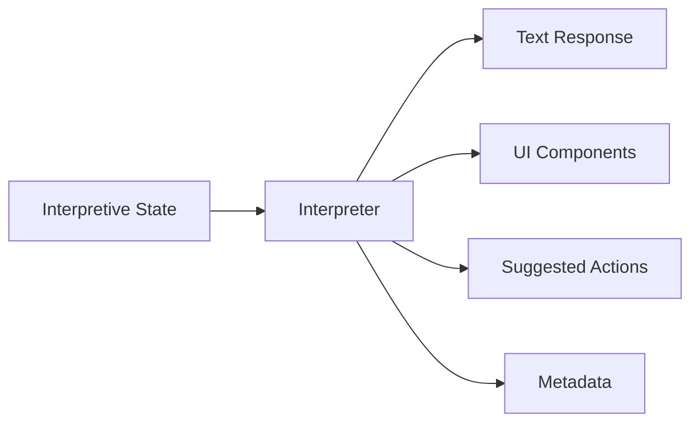
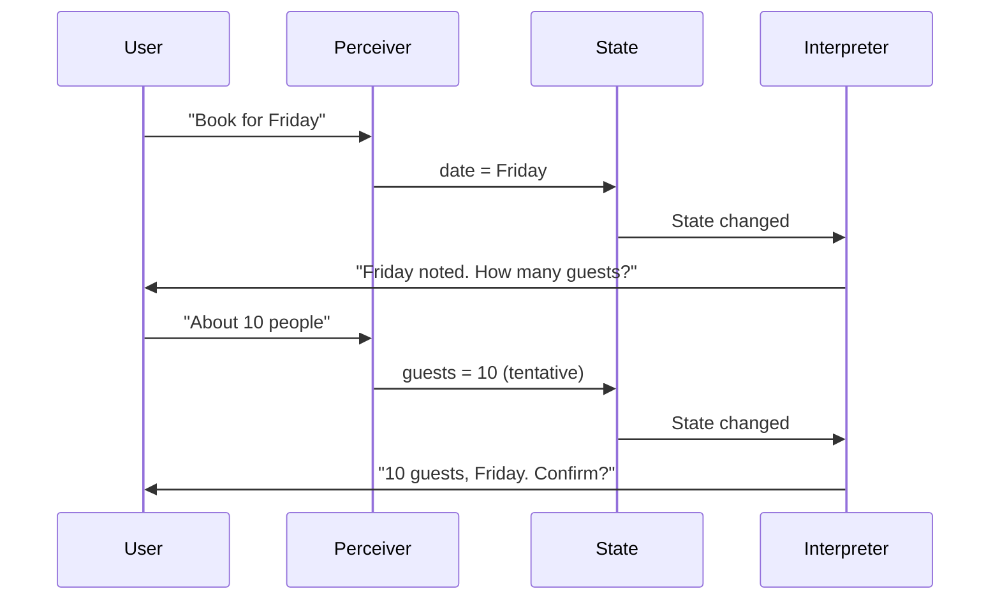

LangState decomposes traditional agent logic into two distinct components: **Perceiver** and **Interpreter**. This split organizes responsibilities around interpretive state as the central coordination point.

## Rationale for Decomposition

Traditional agents combine multiple responsibilities:



This creates several problems:

| Problem | Impact |
|---------|--------|
| **Tight coupling** | Changes to input handling affect output generation |
| **Difficult testing** | Must test entire agent for any behavior |
| **Mixed concerns** | Business logic intertwined with presentation |
| **Limited reuse** | Can't reuse response generation across input types |

## The Split Architecture

LangState splits agent logic around interpretive state:



**Perceiver**: Handles everything from input to state update  
**Interpreter**: Handles everything from state to output

The split point is **interpretive state** — the shared representation both components read and write.

## Benefits of the Split

<CardGroup cols={2}>
  <Card title="Independent Testing" icon="flask">
    Test Perceiver with inputs → state assertions<br/>
    Test Interpreter with state → output assertions
  </Card>
  <Card title="Flexible Composition" icon="puzzle-piece">
    Mix different Perceivers (text, voice, UI) with same Interpreter
  </Card>
  <Card title="Clear Contracts" icon="file-contract">
    Perceiver produces state updates<br/>
    Interpreter consumes state
  </Card>
  <Card title="Parallel Development" icon="users">
    Teams can work on input and output handling independently
  </Card>
</CardGroup>

---

## Perceiver

The **Perceiver** transforms raw input into interpretive state updates.

### Input Ingestion

The Perceiver accepts input from multiple modalities:



### Multimodal Handling

Each input type requires specific processing:

| Input Type | Processing | State Update |
|------------|-----------|--------------|
| **Text** | NLU, entity extraction | Field values with confidence |
| **Voice** | Transcription + Text processing | Same as text, with transcription metadata |
| **UI Components** | Event parsing | Direct field updates (high confidence) |
| **Files** | Content extraction | Structured data injection |

### Example: Text Input Processing

```python
class TextPerceiver:
    def perceive(self, text_input, current_state):
        # Extract entities and intent
        extraction = self.extract(text_input)
        
        # Create state update
        update = StateUpdate()
        
        for entity in extraction.entities:
            update.set(
                field=entity.field,
                value=entity.value,
                confidence=entity.confidence,
                source="user_explicit" if entity.explicit else "user_implicit"
            )
        
        return update
```

### Example: UI Event Processing

```python
class UIPerceiver:
    def perceive(self, ui_event, current_state):
        update = StateUpdate()
        
        if ui_event.type == "selection":
            update.set(
                field=ui_event.field,
                value=ui_event.selected_value,
                confidence=1.0,  # UI selections are explicit
                source="user_explicit"
            )
        elif ui_event.type == "form_submit":
            for field, value in ui_event.form_data.items():
                update.set(field=field, value=value, confidence=1.0)
        
        return update
```

### Normalization

The Perceiver normalizes diverse inputs into consistent state updates:

```
Input: "next friday"
       "Friday, March 15th"
       UI date picker selection
       
All normalize to:
{
  "date": {
    "value": "2024-03-15",
    "confidence": [varies by source]
  }
}
```

---

## Interpreter

The **Interpreter** reacts to interpretive state changes to generate responses and UI.

### Reacting to State Changes

The Interpreter receives the current state and produces output:

```python
class Interpreter:
    def interpret(self, state, state_diff=None):
        # Analyze current state
        analysis = self.analyze_state(state)
        
        # Determine response strategy
        if analysis.needs_clarification:
            return self.generate_clarification(analysis.ambiguous_fields)
        elif analysis.ready_for_confirmation:
            return self.generate_confirmation(state)
        else:
            return self.generate_progress_response(state, state_diff)
```

### Feedback Generation

The Interpreter generates appropriate feedback based on state:

| State Condition | Feedback Type |
|----------------|---------------|
| New confirmed value | Acknowledgment |
| Ambiguous field | Clarifying question |
| Missing required | Guided prompt |
| Ready for commit | Confirmation request |
| Validation error | Correction guidance |

### Multi-Stream Response Strategies

The Interpreter can produce multiple output streams:



**Example multi-stream response**:

```python
class MultiStreamInterpreter:
    def interpret(self, state):
        return InterpretationResult(
            text="I've noted your preference for Friday. How many guests?",
            ui_components=[
                GuestCountSlider(min=1, max=20, default=state.guests.hint),
                DateConfirmationCard(date=state.date.value)
            ],
            suggested_actions=[
                Action("confirm_date", "Confirm Friday"),
                Action("change_date", "Pick different date")
            ],
            metadata={
                "confidence": state.overall_confidence,
                "next_required": "guest_count"
            }
        )
```

### State-Driven Response Selection

```python
class Interpreter:
    def select_response_strategy(self, state):
        if state.formation.phase == "accumulating":
            return AccumulationStrategy()  # Brief acknowledgments
        elif state.formation.phase == "stabilizing":
            return StabilizationStrategy()  # Confirmation prompts
        elif state.formation.phase == "ready":
            return CommitmentStrategy()  # Final confirmation
        else:
            return DefaultStrategy()
```

---

## Coordination Through State

The Perceiver and Interpreter coordinate through interpretive state:



Neither component needs to know about the other's implementation — they only interact through the shared state representation.

## Summary

| Component | Input | Output | Responsibility |
|-----------|-------|--------|----------------|
| **Perceiver** | User input (any modality) | State updates | Understand and normalize |
| **Interpreter** | Current state | Response/UI | React and present |

This decomposition enables modular, testable, and flexible agent architectures built around the central concept of interpretive state.
