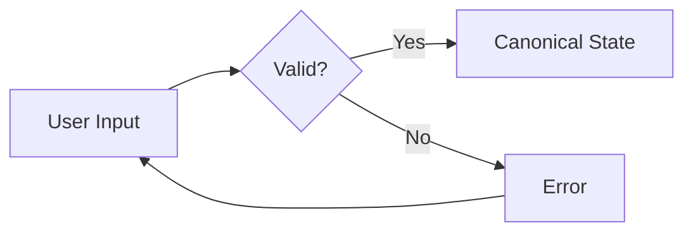
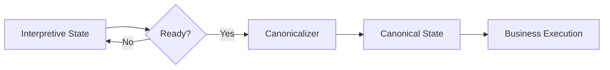

**Canonical State** represents the final, validated business artifact that results from a conversation. It is the authoritative record that downstream systems consume.

## Definition

Canonical State is a **deterministic, validated data structure** that:

- Conforms to a strict business schema
- Contains only confirmed, valid values
- Is ready for execution or persistence
- Serves as the system of record

## Key Properties

<CardGroup cols={2}>
  <Card title="Deterministic" icon="equals">
    Same inputs always produce the same canonical state
  </Card>
  <Card title="Validated" icon="check">
    All required fields present and constraints satisfied
  </Card>
  <Card title="Minimal" icon="compress">
    Contains only business-essential data, no interaction metadata
  </Card>
  <Card title="Authoritative" icon="gavel">
    Single source of truth for business processes
  </Card>
</CardGroup>

## Execution-Safe Representation

Canonical state must be safe to execute against:

```json
{
  "booking": {
    "event_id": "evt_2024031501",
    "date": "2024-03-15",
    "time": "18:00",
    "guest_count": 12,
    "venue_id": "venue_room_a",
    "contact_email": "user@example.com",
    "status": "confirmed"
  }
}
```

**Guarantees**:
- All required fields are present
- All values pass validation
- References (IDs) are resolved and valid
- No ambiguity or tentative values

## Canonical vs Interpretive State

| Aspect | Canonical State | Interpretive State |
|--------|-----------------|-------------------|
| Schema | Strict, validated | Flexible, extensible |
| Values | Final only | Tentative, candidates, partial |
| Metadata | None | Confidence, source, history |
| Purpose | Business execution | Interaction support |
| Lifecycle | Created once at commitment | Evolves throughout conversation |

## Why Canonical State Alone Is Insufficient

Many systems attempt to use canonical state directly as the interaction model. This creates several problems:

### Problem 1: Premature Validation



When validation gates every update, partial progress is lost and users face repeated errors.

### Problem 2: No Room for Ambiguity

Canonical schemas typically don't support:
```json
{
  "date": ["Friday", "Saturday"]  // Invalid: must be single value
}
```

Users must resolve ambiguity before the system can record anything.

### Problem 3: Lost Context

Canonical state contains:
```json
{ "guest_count": 12 }
```

But not:
```json
{
  "guest_count": 12,
  "original_estimate": 10,
  "increased_because": "added_family_members"
}
```

The reasoning and history are lost.

### Problem 4: Interaction Overhead

Every field interaction must:
1. Validate against full schema
2. Check all constraints
3. Resolve all dependencies

This overhead slows interaction and creates friction.

## The Role of Canonical State

Despite these limitations, canonical state remains essential:

<Steps>
  <Step title="Business Authority">
    Canonical state is the contract with downstream systems — APIs, databases, external services all consume canonical state
  </Step>
  <Step title="Validation Checkpoint">
    Before execution, all business rules must be satisfied — canonical state represents this checkpoint
  </Step>
  <Step title="Audit Trail">
    The canonical record provides the authoritative version for compliance, debugging, and analytics
  </Step>
</Steps>

## Canonical State in LangState

In LangState's architecture, canonical state:

1. **Is derived from** interpretive state through the Canonicalizer
2. **Only exists when** interpretive state is ready for commitment
3. **Does not replace** interpretive state during interaction
4. **Triggers execution** of business processes



## Example Comparison

**Interpretive State** (during conversation):
```json
{
  "event": {
    "type": { "value": "birthday", "status": "confirmed" },
    "date": { "value": "2024-03-15", "confidence": 0.95 },
    "time": { 
      "candidates": ["18:00", "19:00"], 
      "status": "ambiguous" 
    }
  },
  "formation_status": { "ready_for_commit": false }
}
```

**Canonical State** (after commitment):
```json
{
  "event": {
    "type": "birthday",
    "date": "2024-03-15",
    "time": "18:00"
  }
}
```

The interpretive state enables rich interaction; the canonical state enables reliable execution. Both are necessary — they serve different purposes in the system architecture.
