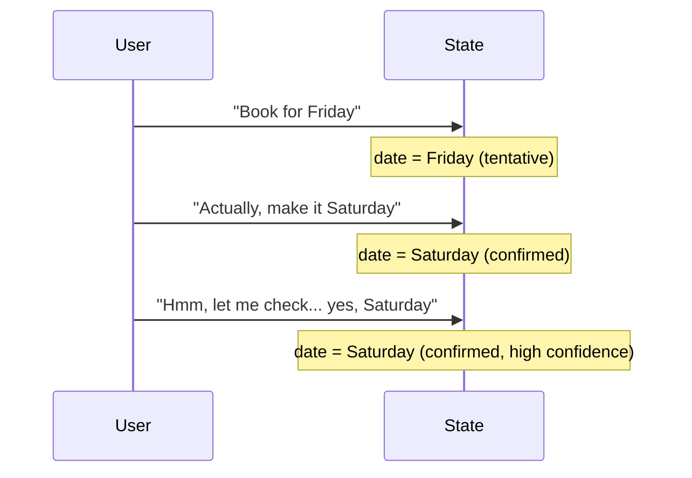

**Interpretive State** is the primary substrate for interaction in LangState. It captures user intent in a form that tolerates ambiguity, supports revision, and enables natural conversation flow.

## Definition

Interpretive State is a **structured representation** of the system's current understanding of user intent, including:

- Confirmed values
- Tentative values with confidence scores
- Multiple candidate values for ambiguous fields
- Metadata about how values were derived

Unlike canonical state (which represents final, validated business data), interpretive state is designed for **interaction** — it evolves fluidly as conversation progresses.

## Key Properties

<CardGroup cols={2}>
  <Card title="Flexible Structure" icon="shapes">
    Fields can hold single values, multiple candidates, or partial information
  </Card>
  <Card title="Revision-Tolerant" icon="rotate">
    Any field can be updated or replaced without cascading failures
  </Card>
  <Card title="Uncertainty-Aware" icon="question">
    Confidence scores and status indicators track certainty levels
  </Card>
  <Card title="Source-Tracked" icon="fingerprint">
    Each value records where it came from (user input, inference, default)
  </Card>
</CardGroup>

## State Field Anatomy

Each field in interpretive state can carry rich metadata:

```json
{
  "date": {
    "value": "2024-03-15",
    "status": "confirmed",
    "confidence": 0.95,
    "source": "user_explicit",
    "turn": 3
  },
  "party_size": {
    "value": 8,
    "status": "tentative",
    "confidence": 0.7,
    "source": "user_implicit",
    "alternatives": [6, 10],
    "turn": 2
  }
}
```

### Status Values

| Status | Meaning |
|--------|---------|
| `tentative` | Captured but not confirmed by user |
| `confirmed` | Explicitly confirmed by user |
| `inferred` | Derived from other fields or context |
| `ambiguous` | Multiple candidates, needs clarification |
| `invalid` | Failed validation, needs correction |

### Source Types

| Source | Meaning |
|--------|---------|
| `user_explicit` | User directly stated the value |
| `user_implicit` | Inferred from user's indirect statement |
| `system_default` | System-provided default value |
| `derived` | Computed from other state fields |

## Partial Values

Interpretive state gracefully handles **partial information**:

```json
{
  "address": {
    "street": { "value": "123 Main St", "status": "confirmed" },
    "city": { "value": null, "status": "pending" },
    "state": { "value": "CA", "status": "inferred" },
    "zip": { "value": null, "status": "pending" }
  }
}
```

The system can work with incomplete information, filling in gaps as conversation continues.

## Multi-Candidate Fields

When user input is ambiguous, interpretive state holds **multiple candidates**:

```json
{
  "venue": {
    "candidates": [
      { "name": "The Grand Hall", "score": 0.8 },
      { "name": "Grand Ballroom", "score": 0.6 },
      { "name": "Grande Restaurant", "score": 0.4 }
    ],
    "status": "ambiguous",
    "clarification_needed": true
  }
}
```

The Interpreter can use this to generate clarifying questions, while the UI can display options for user selection.

## Revision and Convergence

Interpretive state naturally supports revision:



**Convergence** occurs when:
- Confidence increases over turns
- Alternatives are eliminated
- User provides explicit confirmation

## Comparison with Canonical State

| Aspect | Interpretive State | Canonical State |
|--------|-------------------|-----------------|
| Purpose | Interaction substrate | Business record |
| Ambiguity | Tolerated and tracked | Not allowed |
| Revision | Natural and expected | Requires formal change |
| Validation | Soft constraints | Hard validation |
| Lifecycle | Evolves throughout conversation | Created at commitment |

## Example: Full Interpretive State

```json
{
  "intent": "event_booking",
  "event": {
    "type": { "value": "birthday_party", "status": "confirmed" },
    "date": { "value": "2024-03-15", "status": "confirmed" },
    "time": { "value": "18:00", "status": "tentative", "confidence": 0.7 }
  },
  "guests": {
    "count": { "value": 12, "status": "confirmed" },
    "names": { "value": ["Alice", "Bob"], "status": "partial" }
  },
  "venue": {
    "candidates": ["Room A", "Room B"],
    "preference": "Room A",
    "status": "ambiguous"
  },
  "formation_status": {
    "phase": "stabilizing",
    "coverage": 0.75,
    "ready_for_commit": false
  }
}
```

This rich representation enables natural interaction, generative UI, and precise evaluation — all built on the foundation of interpretive state.
