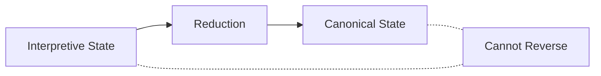
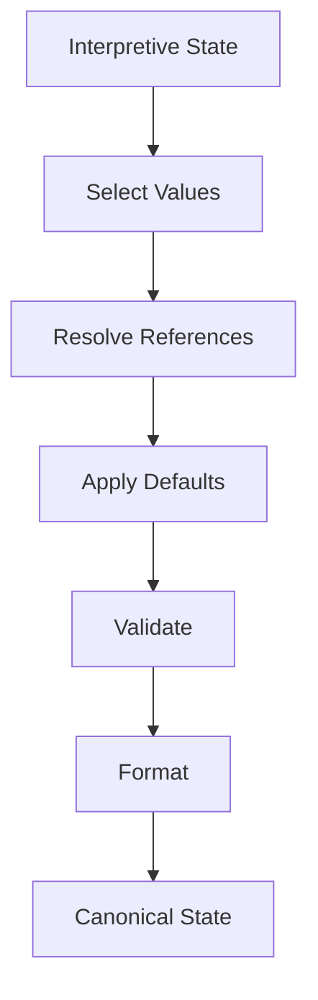
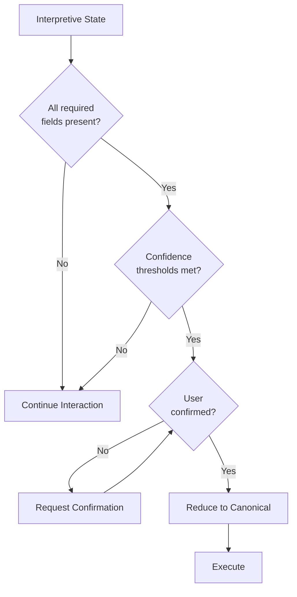

The transformation from interpretive state to canonical state is a **one-way reduction** process. This reduction occurs at commitment boundaries when interpretive state has stabilized sufficiently.

## One-Way Reducibility

The reduction from interpretive to canonical state is **one-way** — information is lost in the process:



**What gets preserved**:
- Final values for each field
- Resolved references (IDs)
- Validated data

**What gets discarded**:
- Confidence scores
- Alternative candidates
- Source tracking
- Revision history
- UI metadata

## Reduction Process

The Canonicalizer applies a series of operations to produce canonical state:



### Step 1: Select Values

For each field, select the canonical value:

| Interpretive State | Selection Rule | Canonical Value |
|-------------------|----------------|-----------------|
| `{ value: "X", status: "confirmed" }` | Use confirmed value | `"X"` |
| `{ candidates: ["A", "B"], preference: "A" }` | Use preference | `"A"` |
| `{ value: 10, confidence: 0.95 }` | Use value if above threshold | `10` |

### Step 2: Resolve References

Convert human-readable values to system identifiers:

```json
// Interpretive
{ "venue": { "value": "The Grand Hall" } }

// Canonical (after reference resolution)
{ "venue_id": "venue_grand_hall_001" }
```

### Step 3: Apply Defaults

Fill any remaining gaps with schema defaults:

```json
// Interpretive (missing notification preference)
{ "contact": { "email": "user@example.com" } }

// Canonical (with default applied)
{ 
  "contact_email": "user@example.com",
  "notification_preference": "email"  // default
}
```

### Step 4: Validate

Ensure canonical state satisfies all schema constraints:

- Required fields present
- Type constraints satisfied
- Business rules pass
- References valid

### Step 5: Format

Transform to final canonical schema format:

```json
// Canonical State
{
  "booking_id": "bk_20240315_001",
  "event_date": "2024-03-15",
  "event_time": "18:00:00",
  "guest_count": 12,
  "venue_id": "venue_grand_hall_001",
  "contact_email": "user@example.com",
  "status": "confirmed",
  "created_at": "2024-03-10T14:30:00Z"
}
```

## Commitment Boundaries

Reduction only occurs at **commitment boundaries** — specific points where the system transitions from exploration to execution:

<CardGroup cols={2}>
  <Card title="User Confirmation" icon="user-check">
    User explicitly confirms: "Yes, book it"
  </Card>
  <Card title="Completeness" icon="list-check">
    All required fields present and stable
  </Card>
  <Card title="Time Trigger" icon="clock">
    Session timeout with sufficient state
  </Card>
  <Card title="Explicit Action" icon="hand-pointer">
    User clicks "Submit" or equivalent
  </Card>
</CardGroup>

## Commitment Decision Logic



## Partial Commitment

Some systems support **partial commitment** — canonicalizing subsets of state while continuing to refine others:

```json
// Interpretive State
{
  "booking": { 
    "date": { "value": "2024-03-15", "status": "confirmed" },
    "venue": { "status": "ambiguous", "candidates": ["A", "B"] }
  }
}

// Partial Canonical State
{
  "booking": {
    "date": "2024-03-15",
    "venue": null,  // Not yet committed
    "status": "partial"
  }
}
```

This enables progressive locking of finalized decisions while keeping flexibility for unresolved fields.

## Irreversibility and Its Implications

The one-way nature of reduction has important implications:

<Warning>
Once reduced to canonical state, the rich interaction context is lost. If the user needs to make changes after commitment, a new interaction cycle begins.
</Warning>

**Design implications**:
1. **Confirm before committing** — ensure user intent is clear
2. **Preserve interpretive state** — keep it for debugging/audit even after canonicalization
3. **Design for revision** — make it easy to start new interactions if changes are needed

## Summary

| Aspect | Description |
|--------|-------------|
| Direction | Interpretive → Canonical (one-way) |
| Trigger | Commitment boundary reached |
| Information Loss | Confidence, alternatives, history |
| Output | Validated, executable business state |
| Reversibility | Not possible — new interaction required |

The reduction process is the bridge between the flexible world of interaction and the deterministic world of business execution.
