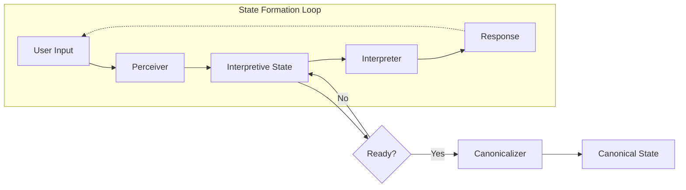
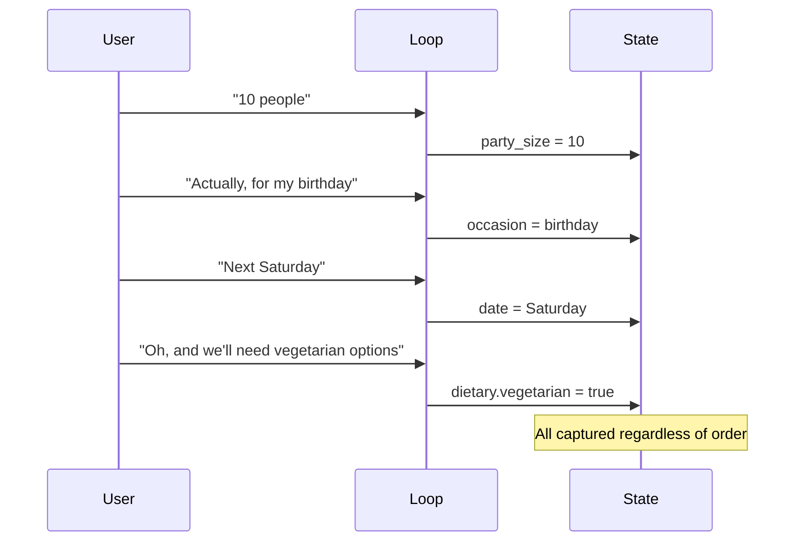

The **State Formation Loop** is the fundamental rhythm of interaction in LangState. It describes how user intent is incrementally accumulated, tolerated as ambiguous, and eventually stabilized before commitment.

## The Loop Structure



Each turn through the loop:
1. **Perceives** new input and normalizes it
2. **Updates** interpretive state with new information
3. **Interprets** the updated state for response generation
4. **Evaluates** whether state is ready for canonicalization

## Incremental Intent Accumulation

Rather than trying to capture complete intent in a single turn, the loop **accumulates** intent incrementally:

```
Turn 1: "I need to book something for the team"
        → { intent: "booking", scope: "team" }

Turn 2: "Probably next Friday"
        → { intent: "booking", scope: "team", 
            date: { value: "next Friday", confidence: 0.7 } }

Turn 3: "For about 10 people"
        → { intent: "booking", scope: "team",
            date: { value: "next Friday", confidence: 0.7 },
            party_size: { value: 10, confidence: 0.8 } }
```

Each turn adds to the accumulated understanding without discarding previous context.

## Tolerance for Ambiguity

The loop explicitly tolerates ambiguity rather than forcing premature resolution:

<Tabs>
  <Tab title="Ambiguous Input">
    ```
    User: "Maybe Friday or Saturday, I'm not sure yet"
    ```
    
    **Interpretive State**:
    ```json
    {
      "date": {
        "candidates": ["Friday", "Saturday"],
        "status": "ambiguous",
        "user_certainty": "low"
      }
    }
    ```
  </Tab>
  <Tab title="Later Resolution">
    ```
    User: "Let's go with Friday"
    ```
    
    **Interpretive State**:
    ```json
    {
      "date": {
        "value": "Friday",
        "status": "confirmed",
        "user_certainty": "high"
      }
    }
    ```
  </Tab>
</Tabs>

The system continues operating with ambiguous state until the user provides clarification — no forcing, no premature commitment.

## Reordering Support

The loop handles out-of-order information naturally:



There's no required sequence — information slots into the appropriate state fields as it arrives.

## Stabilization Before Commitment

The loop distinguishes between **capturing** information and **committing** to action:

| Phase | State Status | Example |
|-------|--------------|---------|
| Accumulating | `tentative`, `partial` | User exploring options |
| Stabilizing | `confirmed`, `consistent` | User converging on choice |
| Ready | All required fields stable | Ready for canonicalization |

**Stabilization indicators**:
- User explicitly confirms values
- Confidence scores exceed thresholds  
- Required fields are all populated
- No recent contradictions or changes

```json
{
  "formation_status": {
    "phase": "stabilizing",
    "stable_fields": ["date", "party_size"],
    "pending_fields": ["venue"],
    "ready_for_commit": false
  }
}
```

Only when the formation status indicates readiness does the Canonicalizer convert interpretive state to canonical state.

## Benefits of the Loop Model

<CardGroup cols={2}>
  <Card title="Natural Interaction" icon="comments">
    Users can express intent in whatever order makes sense to them
  </Card>
  <Card title="Graceful Uncertainty" icon="cloud">
    Ambiguity is a valid state, not an error condition
  </Card>
  <Card title="Observable Progress" icon="chart-line">
    Each turn produces measurable state changes
  </Card>
  <Card title="Safe Commitment" icon="shield-check">
    Actions only execute when intent is sufficiently clear
  </Card>
</CardGroup>

The State Formation Loop provides the foundational rhythm that enables all of LangState's capabilities — natural conversation, generative UI, and reliable evaluation all build on this core loop.
