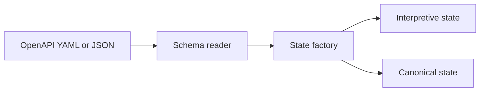
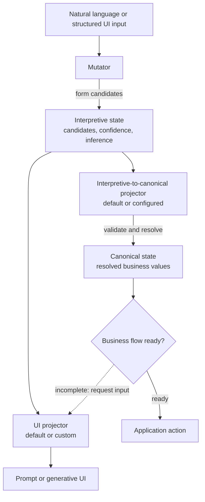

<Warning>
  **Design target.** This page combines implemented state primitives with proposed defaults and generated tooling. Components marked as default or planned are architectural direction, not evidence that a complete runtime ships today.
</Warning>

The design keeps two forms of state explicit:

- **Interpretive state** records candidate values, confidence, and the latest inference produced from conversation, UI, tools, or deterministic inputs.
- **Canonical state** records resolved business values that have passed the application's validation and confirmation policy.

The separation prevents an inferred value from silently becoming an authoritative business fact.

## Bootstrap from the specification

The reader selects the business schema and the state factory initializes both state forms. This is a construction path, not a claim that source values have already been inferred or confirmed.

## Runtime state loop

The projected UI supplies the next natural-language or structured input, so the formation, reduction, and presentation stages repeat until the readiness policy succeeds. Evaluation observes the state, projection, interaction, and action traces without becoming the runtime owner.

## Component responsibilities

### 1. Schema bootstrap

The schema reader selects a business object from an OpenAPI specification. State construction creates canonical field paths and a corresponding interpretive structure. The current `OpenAPIReader` and `StateFactory` provide the concrete starting point; a generator would package that work into a repeatable scaffold.

### 2. State formation

A mutator turns an input into interpretive candidates. Natural language is only one input type: UI submissions, deterministic parsers, retrieved records, and tool results can use the same boundary.

Each update should retain enough identity and provenance to explain which message or interaction changed which field. The latest `inference` is singular per interpretive field, while candidate `values` may contain multiple alternatives.

### 3. Canonical reduction

The interpretive-to-canonical projector applies resolution, validation, and confirmation policy. A target default can make a generated demo runnable, but it must remain configurable because acceptable confidence and conflict resolution are business-specific.

The pinned source defines `BaseProjectorCanonicalState`, including `project()` and `can_trigger_action()`, but does not bundle a concrete policy.

### 4. Presentation loop

The UI projector reads current state and proposes the next prompt or UI components. A host renderer turns those schemas into chat controls, forms, tables, previews, or custom components. User interaction returns through the same mutator boundary.

The source defines `BaseProjectorUI` and UI data models. It does not ship a projector implementation or frontend renderer.

### 5. Action readiness

An action is eligible only after the canonical projector's application-defined readiness policy succeeds. Readiness can require resolved fields, deterministic validation, explicit user confirmation, or domain-specific review.

The action boundary should return `ActionResultData` to the host application, preserving the current source contract instead of introducing a generator-only result shape. Authentication, authorization, transactions, and side-effect recovery stay outside the generated state logic.

### 6. Evaluation plane

Evaluation observes each stage without becoming the runtime owner. A generated suite should be able to compare:

- expected and actual interpretive field updates;
- canonical resolution and confirmation decisions;
- prompt and component selection;
- action-trigger timing and final outcomes; and
- measured latency, token usage, errors, and recovery behavior.

These are proposed measurements, not claims of lower cost or higher reliability. See [Evaluation strategy](/design-notes/evaluation-strategy) for evidence and reproducibility guidance.

## Integration boundary

| Boundary | Generated module target | Host application responsibility |
| --- | --- | --- |
| Input adapter | Convert host events into LangState inputs | Conversation transport, identity, and authorization |
| Orchestrator adapter | Invoke the state loop and return interaction or completion data | LangGraph node wiring, custom loop control, retries, and cancellation |
| State adapter | Expose state access and optional repository hooks | Durable storage selection, tenancy, retention, and transactions |
| UI adapter | Return prompt and component schemas | Rendering, accessibility, design system, and client-side interaction |
| Action adapter | Provide typed stubs and action identifiers | Real API/function implementation, credentials, idempotency, and recovery |
| Evaluation adapter | Emit traceable cases and result artifacts | Dataset governance, model/provider configuration, and release gates |

This boundary is what makes framework integration practical: the host can remain a LangGraph graph or another application architecture while the generated module supplies an explicit state machine behind a small adapter surface.

## Current versus target

The state classes, schema reader, state factory, abstract projectors, mutator contracts, action contracts, and evaluation primitives exist at the pinned commit. The generator, default projectors, test frontend, generated stubs, end-to-end evaluation report, and packaged host-framework adapters are the target layer still to be built.

See [Library target](/design-notes/library-target) for the proposed developer experience and [Implementation status](/implementation-status) for the source-verified capability matrix.
