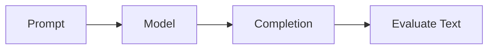
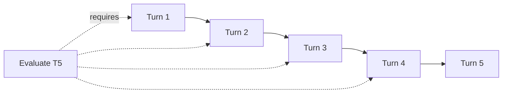
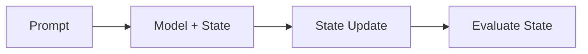

LangState fundamentally changes how we evaluate language-model applications by shifting from **prompt–completion pairs** to **prompt–state pairs**.

## The Traditional Evaluation Surface

Traditional LLM evaluation focuses on text outputs:



**What gets evaluated**:
- Does the completion match expected output?
- Is the response coherent? Helpful? Accurate?
- Does it follow instructions?

**Evaluation methods**:
- Exact match / BLEU / ROUGE
- LLM-as-judge scoring
- Human evaluation

## Problems with Prompt–Completion Evaluation

### Problem 1: Surface-Level Comparison

Two completions can be semantically equivalent but textually different:

```
Expected: "Your booking is confirmed for Friday, March 15."
Actual:   "I've confirmed your reservation for 3/15 (Friday)."
```

Text comparison fails; semantic comparison requires expensive judging.

### Problem 2: Turn Coupling

To evaluate Turn 5, you must replay Turns 1-4:



This makes evaluation:
- **Expensive**: Token cost for all prior turns
- **Slow**: Sequential processing required
- **Fragile**: Early turn changes cascade

### Problem 3: Hidden System State

What does the system "believe" after this conversation?

```
User: "I said Friday"
System: "Friday works great!"
User: "With 10 people"
System: "10 guests, perfect!"
```

The only way to verify is to **ask the system** or replay with variations.

### Problem 4: Non-reproducibility

Same conversation may produce different valid outputs:

```
Run 1: "Your event is set for Friday with 10 guests."
Run 2: "Perfect! Friday, party of 10, all confirmed."
Run 3: "I've got you down for Friday - 10 people total."
```

All correct, but hard to test deterministically.

## The Prompt–State Evaluation Surface

LangState shifts evaluation to state:



**What gets evaluated**:
- Did the state update correctly?
- Are the field values accurate?
- Is the state internally consistent?

## Benefits of State-Based Evaluation

### Benefit 1: Structural Comparison

Compare state objects directly:

```python
expected_state = {
    "date": {"value": "2024-03-15", "status": "confirmed"},
    "guests": {"value": 10, "status": "confirmed"}
}

actual_state = {
    "date": {"value": "2024-03-15", "status": "confirmed"},
    "guests": {"value": 10, "status": "confirmed"}
}

assert actual_state == expected_state  # Simple, deterministic
```

No need for semantic text matching.

### Benefit 2: Turn Isolation

Load state snapshot, apply single input, evaluate result:

```python
def test_turn_5():
    # Load state from Turn 4 (no replay needed)
    state_v4 = load_snapshot("test_case_1_turn_4")
    
    # Apply Turn 5 input
    state_v5 = apply_input(state_v4, "Make it 12 guests instead")
    
    # Evaluate single turn
    assert state_v5.guests.value == 12
    assert state_v5.guests.previous_value == 10
```

### Benefit 3: Observable Beliefs

State explicitly represents system understanding:

```json
{
  "understood": {
    "date": {"value": "Friday", "confidence": 0.95},
    "guests": {"value": 10, "confidence": 1.0},
    "venue": {"value": null, "status": "pending"}
  }
}
```

No need to probe — the state **is** the system's beliefs.

### Benefit 4: Deterministic Diffs

State changes are well-defined:

```python
diff = compute_state_diff(state_v4, state_v5)

# diff = {
#   "changed": {"guests": {"from": 10, "to": 12}},
#   "unchanged": ["date", "venue"],
#   "added": [],
#   "removed": []
# }
```

## Failure Modes Addressed

| Failure Mode | Prompt–Completion | Prompt–State |
|--------------|-------------------|--------------|
| Surface mismatch | Common | Eliminated |
| Hidden state bugs | Hard to detect | Directly visible |
| Turn dependency | Always required | Eliminated |
| Regression localization | Difficult | Straightforward |
| A/B comparison | Expensive | Simple diff |

## Evaluation Workflow Comparison

<Tabs>
  <Tab title="Traditional">
    ```python
    # Test conversation flow
    def test_booking_flow():
        response = model.chat("Book for Friday")
        assert "friday" in response.lower()  # Fragile
        
        response = model.chat("10 people")
        assert "10" in response  # Fragile
        
        response = model.chat("Confirm")
        assert "confirmed" in response  # Fragile
    ```
  </Tab>
  <Tab title="State-Based">
    ```python
    # Test state transitions
    def test_booking_state():
        state = initial_state()
        
        state = apply("Book for Friday", state)
        assert state.date.value == "Friday"
        
        state = apply("10 people", state)
        assert state.guests.value == 10
        
        state = apply("Confirm", state)
        assert state.formation.status == "committed"
    ```
  </Tab>
</Tabs>

## Migration Path

Moving from completion to state evaluation:

<Steps>
  <Step title="Externalize State">
    Add interpretive state tracking to existing system
  </Step>
  <Step title="Snapshot Capture">
    Record state snapshots at each turn during test runs
  </Step>
  <Step title="State Assertions">
    Add state-based assertions alongside text assertions
  </Step>
  <Step title="Deprecate Text Checks">
    Gradually replace fragile text checks with state checks
  </Step>
</Steps>

State-based evaluation enables reliable, efficient, and reproducible testing of conversational AI systems.
