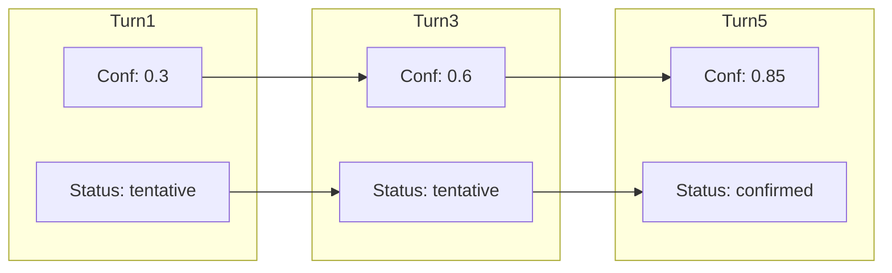

LangState enables quantitative evaluation through **state quality metrics**. These metrics provide objective measures of system performance at each turn.

## Core Metrics

<CardGroup cols={3}>
  <Card title="Consistency" icon="equals">
    Is state internally coherent?
  </Card>
  <Card title="Coverage" icon="list-check">
    How much of required state is filled?
  </Card>
  <Card title="Convergence" icon="bullseye">
    Is state stabilizing toward completion?
  </Card>
</CardGroup>

---

## Consistency

**Consistency** measures whether the state is internally coherent — no contradictions, valid references, and satisfied constraints.

### Consistency Checks

| Check | Description | Example |
|-------|-------------|---------|
| **No contradictions** | Field values don't conflict | Date ≠ "Friday" AND "Saturday" |
| **Valid references** | IDs resolve correctly | venue_id exists in venue list |
| **Constraint satisfaction** | Business rules pass | guest_count ≤ venue.capacity |
| **Type validity** | Values match expected types | date is valid date format |

### Measuring Consistency

```python
def measure_consistency(state):
    checks = [
        check_no_contradictions(state),
        check_valid_references(state),
        check_constraints(state),
        check_types(state)
    ]
    
    passed = sum(1 for c in checks if c.passed)
    return {
        "score": passed / len(checks),
        "failures": [c for c in checks if not c.passed]
    }
```

### Example

```json
{
  "guest_count": 150,
  "venue": { "id": "garden_room", "capacity": 50 }
}
```

**Consistency check**:
```
❌ Constraint violation: guest_count (150) > venue.capacity (50)
Consistency score: 0.75 (3/4 checks passed)
```

---

## Coverage

**Coverage** measures how much of the required state has been captured.

### Coverage Calculation

```python
def measure_coverage(state, schema):
    required_fields = schema.required_fields
    filled_fields = [f for f in required_fields if state.has_value(f)]
    
    return {
        "score": len(filled_fields) / len(required_fields),
        "filled": filled_fields,
        "missing": [f for f in required_fields if f not in filled_fields]
    }
```

### Coverage Levels

| Coverage | Status | Implication |
|----------|--------|-------------|
| 0-25% | Early | Many fields pending |
| 25-50% | Progressing | Core fields being filled |
| 50-75% | Substantial | Most fields captured |
| 75-99% | Near complete | Few fields remaining |
| 100% | Complete | Ready for canonicalization |

### Weighted Coverage

Some fields matter more than others:

```python
def weighted_coverage(state, schema):
    total_weight = sum(f.weight for f in schema.fields)
    filled_weight = sum(f.weight for f in schema.fields if state.has_value(f))
    
    return filled_weight / total_weight
```

### Example

```json
{
  "date": { "value": "2024-03-15" },      // required, weight: 1.0
  "guests": { "value": 20 },              // required, weight: 1.0
  "venue": { "value": null },             // required, weight: 1.5
  "contact": { "value": "a@b.com" },      // required, weight: 1.0
  "special_requests": { "value": null }   // optional, weight: 0.5
}
```

**Coverage**:
```
Required fields: 4 filled / 4 total (venue has value null but candidates)
Weighted: (1.0 + 1.0 + 0 + 1.0) / (1.0 + 1.0 + 1.5 + 1.0) = 66%
```

---

## Convergence

**Convergence** measures whether interpretive state is stabilizing toward canonical form.

### Convergence Indicators

| Indicator | Signal | Measurement |
|-----------|--------|-------------|
| **Confidence increase** | Values becoming certain | Δ confidence per turn |
| **Status progression** | tentative → confirmed | Status transition rate |
| **Revision decrease** | Fewer changes per turn | Edit frequency declining |
| **Candidate reduction** | Options narrowing | Candidate list shrinking |

### Measuring Convergence

```python
def measure_convergence(state_history):
    if len(state_history) < 2:
        return {"score": 0, "trend": "insufficient_data"}
    
    recent = state_history[-3:]  # Last 3 turns
    
    confidence_trend = compute_confidence_trend(recent)
    status_trend = compute_status_trend(recent)
    revision_trend = compute_revision_trend(recent)
    
    score = (confidence_trend + status_trend + (1 - revision_trend)) / 3
    
    return {
        "score": score,
        "confidence_trend": confidence_trend,
        "status_trend": status_trend,
        "revision_rate": revision_trend,
        "trend": "converging" if score > 0.6 else "unstable"
    }
```

### Convergence Over Time



**Convergence score**: Increasing (healthy trajectory)

---

## Combined Quality Score

Combine metrics for overall quality assessment:

```python
def quality_score(state, state_history, schema):
    consistency = measure_consistency(state)
    coverage = measure_coverage(state, schema)
    convergence = measure_convergence(state_history)
    
    # Weighted combination
    return {
        "overall": (
            consistency["score"] * 0.3 +
            coverage["score"] * 0.4 +
            convergence["score"] * 0.3
        ),
        "consistency": consistency,
        "coverage": coverage,
        "convergence": convergence,
        "ready_for_commit": (
            consistency["score"] == 1.0 and
            coverage["score"] == 1.0 and
            convergence["score"] > 0.8
        )
    }
```

## Quality Dashboard

```
┌─────────────────────────────────────────────────────┐
│ State Quality Dashboard                    Turn: 7  │
├─────────────────────────────────────────────────────┤
│                                                     │
│  Consistency   ████████████████████░░░░  85%       │
│                ⚠ 1 constraint warning               │
│                                                     │
│  Coverage      ████████████████░░░░░░░░  70%       │
│                Missing: venue, dietary              │
│                                                     │
│  Convergence   ██████████████████████░░  90%       │
│                ↑ Confidence increasing              │
│                                                     │
│  Overall       ████████████████████░░░░  81%       │
│                                                     │
│  Ready for commit: No (coverage < 100%)            │
│                                                     │
└─────────────────────────────────────────────────────┘
```

## Using Metrics for Evaluation

### Regression Testing

```python
def test_booking_quality():
    state = run_conversation(test_inputs)
    quality = quality_score(state, history, booking_schema)
    
    assert quality["consistency"]["score"] >= 0.95
    assert quality["coverage"]["score"] >= 0.90
    assert quality["convergence"]["score"] >= 0.80
```

### A/B Comparison

```python
def compare_models(model_a, model_b, test_cases):
    results = []
    for case in test_cases:
        quality_a = run_and_score(model_a, case)
        quality_b = run_and_score(model_b, case)
        results.append({
            "case": case.name,
            "model_a": quality_a["overall"],
            "model_b": quality_b["overall"],
            "winner": "a" if quality_a > quality_b else "b"
        })
    return results
```

State quality metrics enable objective, reproducible evaluation of conversational AI systems.
