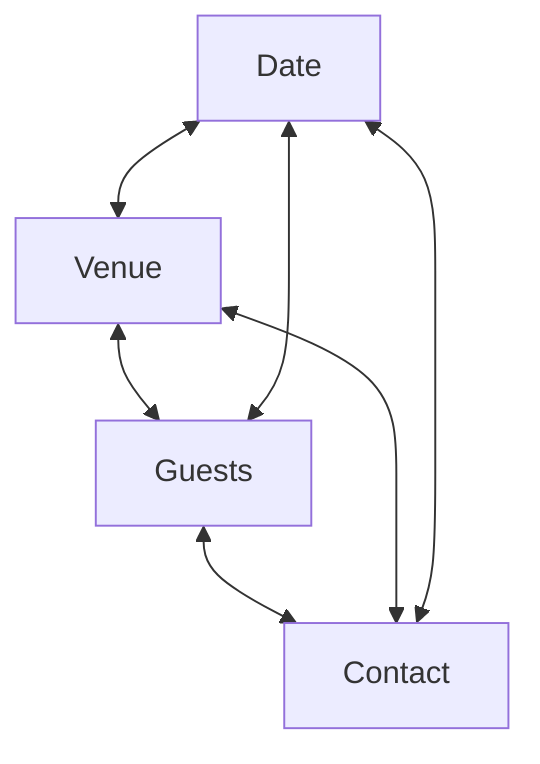
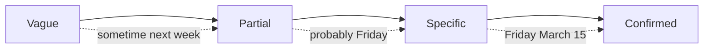

LangState enables flexible interaction patterns that go beyond linear form-filling. Users can jump to any field, refine progressively, and navigate naturally.

## Jump-Anywhere Flows

Unlike traditional wizards or forms, LangState supports **non-linear navigation**:



Users can address any field at any time, in any order.

### How It Works

**Traditional flow** (enforced order):
```
Step 1: Date → Step 2: Venue → Step 3: Guests → Step 4: Contact
        ↓            ✗ Cannot jump           ✗ Cannot go back
```

**Jump-anywhere flow**:
```
User: "Let me start with the venue"     → Updates venue
User: "Oh, and it's for 20 people"      → Updates guests  
User: "The date is March 15"            → Updates date
User: "Actually, make it 25 people"     → Revises guests
```

### State Supports Jump-Anywhere

Interpretive state naturally enables this:

```json
{
  "date": { "value": null, "status": "pending" },
  "venue": { "value": "Garden Room", "status": "confirmed" },
  "guests": { "value": 25, "status": "confirmed" },
  "contact": { "value": null, "status": "pending" }
}
```

No field depends on others being filled first — each is independently addressable.

### UI Implementation

```
┌─────────────────────────────────────────────────┐
│ Event Booking                                   │
├─────────────────────────────────────────────────┤
│                                                 │
│  📅 Date        [Not set - click to add]        │
│                                                 │
│  🏛️ Venue       [Garden Room] ✓                 │
│                                                 │
│  👥 Guests      [25 people] ✓                   │
│                                                 │
│  📧 Contact     [Not set - click to add]        │
│                                                 │
│  ─────────────────────────────────              │
│  Progress: ██████░░░░░░ 50%                     │
│                                                 │
└─────────────────────────────────────────────────┘
```

Users can click any field to edit it directly.

---

## Progressive Refinement

Users often start with vague intent and refine it over time:



### Refinement in State

```json
// Turn 1: Vague
{ "date": { "value": "next week", "status": "vague", "confidence": 0.3 } }

// Turn 2: Partial
{ "date": { "value": "Friday", "status": "tentative", "confidence": 0.6 } }

// Turn 3: Specific
{ "date": { "value": "2024-03-15", "status": "tentative", "confidence": 0.85 } }

// Turn 4: Confirmed
{ "date": { "value": "2024-03-15", "status": "confirmed", "confidence": 0.98 } }
```

### Supporting Refinement in UI

The UI adapts to the refinement level:

<Tabs>
  <Tab title="Vague">
    ```
    Date: [next week (?)]
    └── "Can you be more specific about the date?"
    └── Quick picks: [Mon] [Tue] [Wed] [Thu] [Fri]
    ```
  </Tab>
  <Tab title="Partial">
    ```
    Date: [Friday ⚠]
    └── "Which Friday?"
    └── Options: [Mar 15] [Mar 22] [Mar 29]
    ```
  </Tab>
  <Tab title="Specific">
    ```
    Date: [March 15, 2024 ✓]
    └── [Change date]
    ```
  </Tab>
</Tabs>

---

## Common Interaction Patterns

### Pattern 1: Explore Then Commit

User explores options before deciding:

```
User: "What venues do you have?"
→ Show venue options

User: "Tell me more about the Garden Room"
→ Show venue details

User: "What about the Rooftop?"
→ Show alternative details

User: "Let's go with Garden Room"
→ Commit selection
```

**State evolution**:
```json
// Exploring
{ "venue": { "candidates": [...], "exploring": "garden_room" } }

// Comparing  
{ "venue": { "candidates": [...], "comparing": ["garden_room", "rooftop"] } }

// Committed
{ "venue": { "value": "garden_room", "status": "confirmed" } }
```

### Pattern 2: Bulk Then Refine

User provides multiple values, then refines:

```
User: "Book Garden Room for 20 people on Friday"
→ Set venue, guests, date (all tentative)

User: "Actually, make it Saturday"
→ Refine date

User: "And we might have a few more people, maybe 25"
→ Refine guests with uncertainty
```

### Pattern 3: Constraint-Driven Refinement

System guides based on constraints:

```
User: "Book for 150 people"
→ Guest count noted

System: "Garden Room has capacity for 50. 
         Would you like to see larger venues?"
→ Constraint violation prompts options

User: "Yes, show me options for 150"
→ Filter candidates by constraint
```

### Pattern 4: Parallel Field Entry

User provides multiple fields at once:

```
User: "Friday, 20 people, outdoor venue"
```

**State update** (single turn):
```json
{
  "date": { "value": "Friday", "status": "tentative" },
  "guests": { "value": 20, "status": "confirmed" },
  "venue": { "preference": "outdoor", "candidates": [...] }
}
```

---

## Enabling Patterns Through State Design

These patterns work because interpretive state:

<CardGroup cols={2}>
  <Card title="Tracks Independently" icon="table">
    Each field has its own status and confidence
  </Card>
  <Card title="Allows Partial Values" icon="circle-half-stroke">
    Vague and specific values coexist
  </Card>
  <Card title="Records Preferences" icon="heart">
    Captures preferences separate from selections
  </Card>
  <Card title="Supports Revision" icon="rotate">
    Any field can be updated at any time
  </Card>
</CardGroup>

## Anti-Patterns to Avoid

| Anti-Pattern | Problem | Better Approach |
|--------------|---------|-----------------|
| Forced ordering | Users get stuck | Allow jump-anywhere |
| All-or-nothing | Loses partial progress | Accept incremental input |
| Immediate commitment | No room for refinement | Distinguish tentative/confirmed |
| Hidden state | Users can't verify | Show current understanding |

---

## Summary

| Pattern | User Benefit | State Requirement |
|---------|-------------|-------------------|
| Jump-anywhere | Freedom to navigate | Independent field tracking |
| Progressive refinement | Natural exploration | Confidence/status levels |
| Explore then commit | Informed decisions | Candidate tracking |
| Bulk then refine | Efficient input | Multi-field updates |

These patterns create natural, flexible interactions that feel conversational while providing the efficiency of structured data entry.
