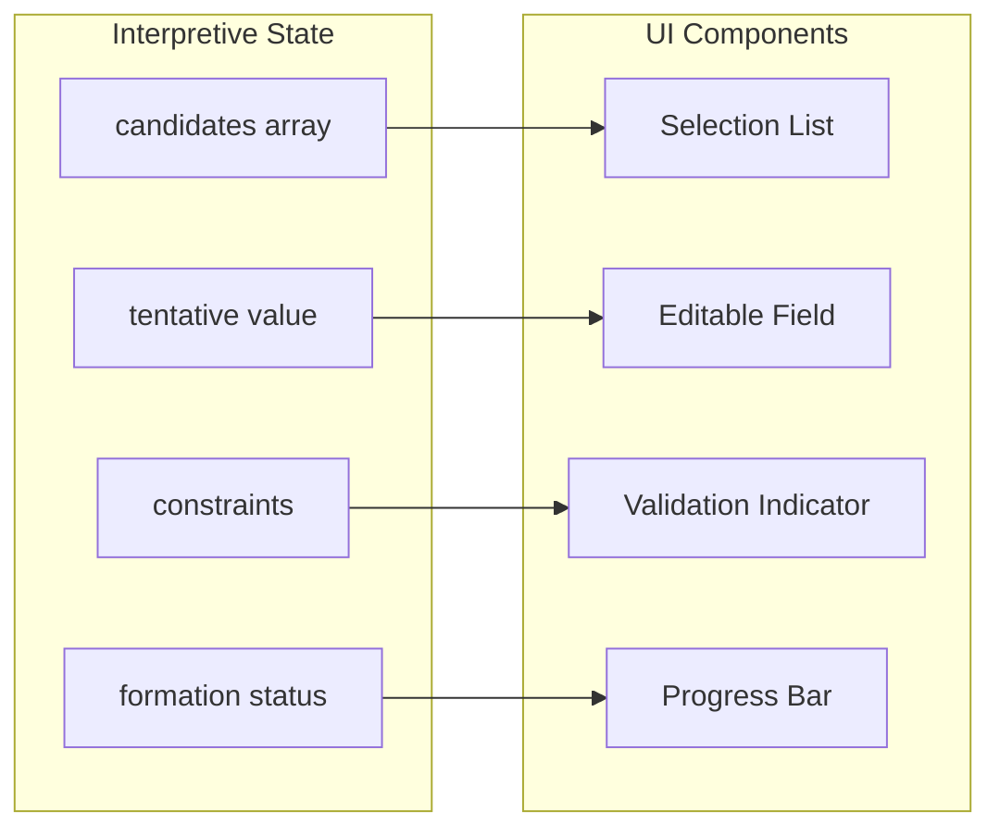
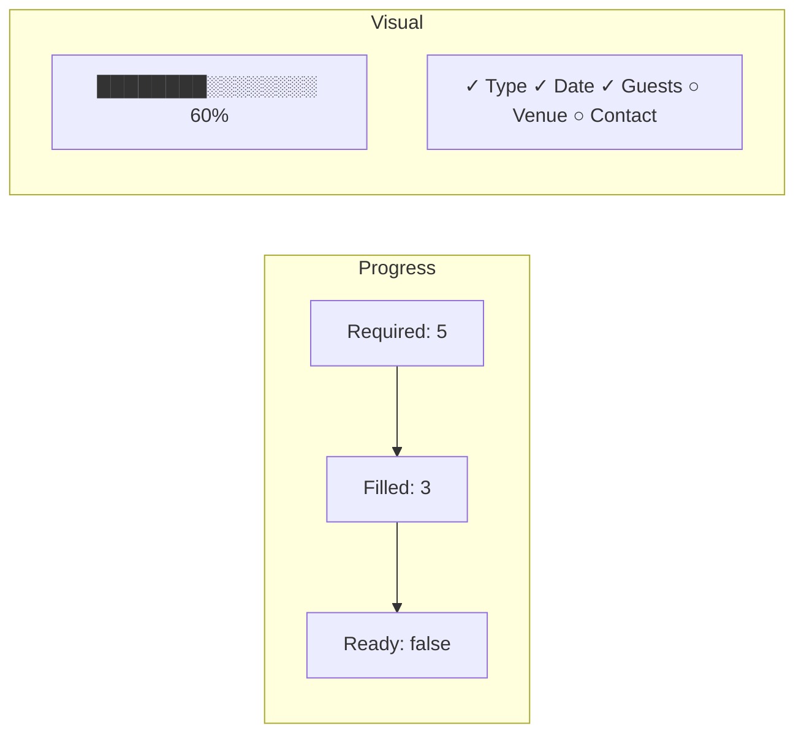
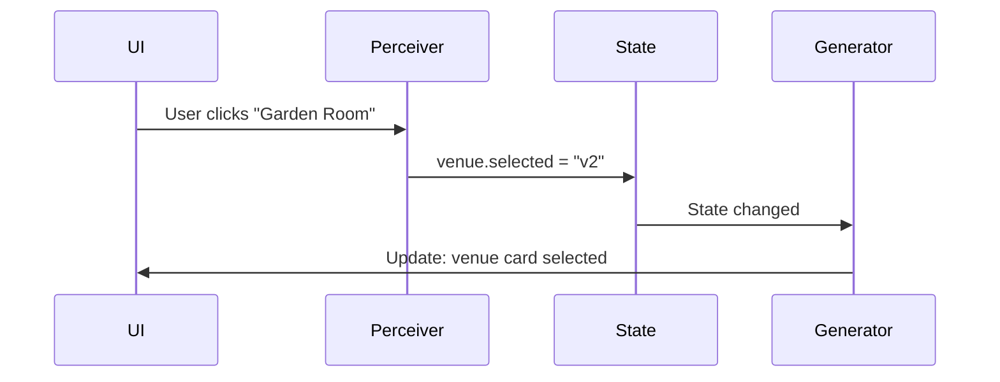

LangState enables **Generative UI** — dynamic interface components generated directly from interpretive state. This creates rich, interactive experiences while maintaining the benefits of conversational AI.

## State-to-Component Mapping

Interpretive state fields map directly to UI components:



### Mapping Rules

| State Property | Condition | UI Component |
|---------------|-----------|--------------|
| `candidates[]` | count ≤ 5 | Radio buttons / Cards |
| `candidates[]` | count > 5 | Searchable dropdown |
| `value` + `editable: true` | — | Inline edit field |
| `status: "ambiguous"` | — | Clarification prompt |
| `confidence` | < threshold | Confirmation badge |
| `constraints` | — | Validation indicator |

## Example: Complete State-to-UI Mapping

**Interpretive State**:
```json
{
  "event_type": {
    "value": "birthday",
    "status": "confirmed",
    "editable": true
  },
  "date": {
    "value": "2024-03-15",
    "status": "tentative",
    "confidence": 0.8,
    "editable": true
  },
  "venue": {
    "candidates": [
      { "id": "v1", "name": "Grand Hall", "capacity": 100 },
      { "id": "v2", "name": "Garden Room", "capacity": 50 },
      { "id": "v3", "name": "Rooftop", "capacity": 75 }
    ],
    "selected": null,
    "status": "pending"
  },
  "guests": {
    "count": { "value": 25, "status": "confirmed" },
    "constraints": { "min": 10, "max": 100 }
  },
  "formation": {
    "coverage": 0.6,
    "phase": "accumulating"
  }
}
```

**Generated UI**:

```
┌─────────────────────────────────────────────────┐
│ Event Booking                        [60% ████░░░░░░]│
├─────────────────────────────────────────────────┤
│                                                 │
│  Event Type: [Birthday Party    ▾] ✓ Confirmed  │
│                                                 │
│  Date: [March 15, 2024  📅] ⚠ Tentative        │
│        "Did you mean Friday, March 15?"         │
│                                                 │
│  Venue: Select one                              │
│  ┌──────────┐ ┌──────────┐ ┌──────────┐        │
│  │Grand Hall│ │Garden    │ │Rooftop   │        │
│  │Cap: 100  │ │Room      │ │Cap: 75   │        │
│  │          │ │Cap: 50   │ │          │        │
│  └──────────┘ └──────────┘ └──────────┘        │
│                                                 │
│  Guests: [25] ✓ (10-100)                       │
│                                                 │
└─────────────────────────────────────────────────┘
```

## Partial Intent Visualization

Generative UI excels at showing **partial intent** — what's been understood so far:

### Confirmed vs Tentative

```
✓ Confirmed:  [March 15]     — solid styling, subtle indicator
⚠ Tentative:  [~10 people]   — dashed border, clarification option
? Ambiguous:  [Fri or Sat?]  — options displayed for selection
```

### Progress Indication



### Candidate Visualization

When multiple options exist, show them for easy selection:

```
Venue Preference:
┌─────────────────────────────────────────────────┐
│ ○ Grand Hall                                    │
│   Capacity: 100 | Indoor | $$                   │
│   [View Details]                                │
├─────────────────────────────────────────────────┤
│ ○ Garden Room                                   │
│   Capacity: 50 | Outdoor | $                    │
│   [View Details]                                │
├─────────────────────────────────────────────────┤
│ ○ Rooftop Terrace                              │
│   Capacity: 75 | Outdoor | $$$                  │
│   [View Details]                                │
└─────────────────────────────────────────────────┘
```

## Dynamic Component Selection

The UI generator selects components based on state properties:

```python
def generate_component(field_state):
    if field_state.candidates:
        if len(field_state.candidates) <= 3:
            return CardGrid(field_state.candidates)
        elif len(field_state.candidates) <= 10:
            return RadioList(field_state.candidates)
        else:
            return SearchableDropdown(field_state.candidates)
    
    elif field_state.type == "date":
        return DatePicker(
            value=field_state.value,
            confirmed=field_state.status == "confirmed"
        )
    
    elif field_state.type == "number":
        return NumberInput(
            value=field_state.value,
            min=field_state.constraints.get("min"),
            max=field_state.constraints.get("max")
        )
    
    elif field_state.editable:
        return InlineEdit(
            value=field_state.value,
            confidence=field_state.confidence
        )
    
    else:
        return DisplayValue(field_state.value)
```

## State Updates from UI

UI interactions flow back as state updates:



## Benefits of State-Driven UI

<CardGroup cols={2}>
  <Card title="Consistency" icon="equals">
    UI always reflects current state accurately
  </Card>
  <Card title="Reactivity" icon="bolt">
    State changes automatically update UI
  </Card>
  <Card title="Flexibility" icon="shuffle">
    Same state can render differently per context
  </Card>
  <Card title="Testability" icon="flask">
    UI generation can be tested with mock state
  </Card>
</CardGroup>

## Implementation Pattern

```python
class GenerativeUI:
    def __init__(self, component_registry):
        self.registry = component_registry
    
    def generate(self, interpretive_state):
        components = []
        
        # Progress indicator
        components.append(
            ProgressBar(interpretive_state.formation.coverage)
        )
        
        # Field components
        for field_name, field_state in interpretive_state.fields():
            component = self.registry.select_component(field_state)
            components.append(component)
        
        # Action buttons based on formation status
        if interpretive_state.formation.ready_for_commit:
            components.append(ConfirmButton())
        
        return UILayout(components)
```

Generative UI transforms interpretive state into rich, interactive experiences that complement natural conversation.
