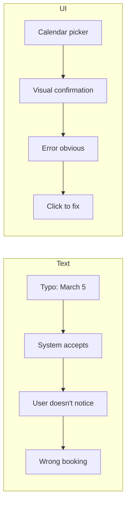

Text-based conversation, while natural, has fundamental limitations for complex interactive tasks. Understanding these limits motivates the need for **Generative UI**.

## Limits of Linear Chat

Linear chat follows a simple pattern:

```
User: message
System: response
User: message
System: response
...
```

This works well for simple Q&A but breaks down for complex tasks:

### Problem 1: Serial Information Transfer

```
System: "What date works for you?"
User: "Friday"
System: "How many guests?"
User: "10"
System: "Any dietary restrictions?"
User: "2 vegetarian"
System: "Preferred venue style?"
User: "Outdoor"
...
```

<Warning>
Collecting 10 fields takes at least 10 turns. A simple form would take seconds.
</Warning>

### Problem 2: Invisible State

The user cannot see what the system understands:

```
System: "I've noted your preferences. Anything else?"
User: [Has no idea what's been recorded]
User: "Did you get the vegetarian count?"
System: "Yes, 2 vegetarian guests."
```

Users must ask to verify, wasting turns and creating friction.

### Problem 3: Difficult Revision

```
User: "I said 10 guests but actually it's 12"
System: "Updated to 12 guests."
User: "And the date should be Saturday not Friday"
System: "Updated to Saturday."
User: "Wait, which venue did you have?"
```

Without visual state display, revisions become guessing games.

### Problem 4: Option Discovery

```
System: "Which venue would you prefer?"
User: "What are my options?"
System: "We have Grand Hall, Garden Room, Rooftop Terrace, 
        Conference Center, Poolside Pavilion, and..."
User: [Reading a wall of text]
```

Lists in text are hard to scan, compare, and select from.

## Cognitive Load Comparison

| Task | Text Chat | Visual UI |
|------|-----------|-----------|
| Input 5 fields | 5+ turns | 1 form view |
| Review current state | Ask and read | Glance at summary |
| Select from 10 options | Parse text list | Visual grid |
| Revise a field | State which + new value | Click and edit |
| Understand progress | "What's left?" | Progress bar |

## Error Recovery

Text makes errors hard to catch and fix:



Visual confirmation at each step prevents errors from propagating.

## When Text Works

Text remains appropriate for:

<CardGroup cols={2}>
  <Card title="Open-ended discussion" icon="comments">
    Brainstorming, advice, exploration
  </Card>
  <Card title="Simple queries" icon="magnifying-glass">
    Single questions with single answers
  </Card>
  <Card title="Explanation" icon="book">
    Learning, teaching, describing
  </Card>
  <Card title="Ambiguous intent" icon="cloud">
    When the user doesn't know what they want yet
  </Card>
</CardGroup>

## When Text Falls Short

Text becomes limiting for:

| Scenario | Why Text Fails |
|----------|---------------|
| **Multi-field data entry** | Too many turns |
| **Selection from options** | Hard to compare |
| **State verification** | Invisible state |
| **Precise values** | Typo risk |
| **Complex revision** | Hard to target specific fields |
| **Progress tracking** | No visual indicator |

## The Solution: Generative UI

Generative UI addresses these limitations by:

1. **Showing state visually** — users see what's been captured
2. **Enabling direct manipulation** — click to edit, drag to reorder
3. **Presenting options clearly** — grids, cards, comparisons
4. **Tracking progress** — visual indicators of completion
5. **Combining with text** — natural language where it helps, UI where it's better

The next sections explore how LangState enables Generative UI through interpretive state.
