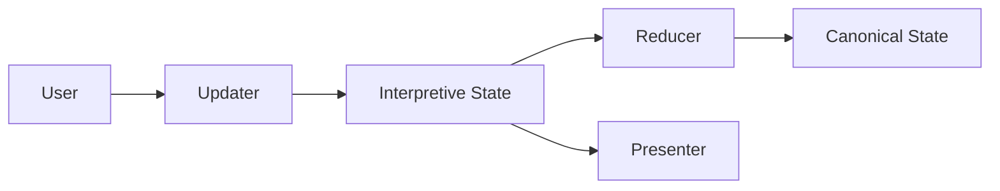

**Interpretive State** is an interaction-first state model that is mapped or reduced into the Canonical State through a reducer. It is introduced as an extension layer around the Canonical State to support language-driven interaction, ambiguity, partial information, and UI-level affordances that cannot be cleanly represented in a strict business schema.

The Canonical State remains minimal, validated, and authoritative. Interpretive State exists to capture everything *before* that point: how information is expressed, inferred, constrained, negotiated, and presented during interaction. This separation is intentional and foundational.

## Why Interpretive State?

Interpretive State is introduced to:

- Enable natural, flexible user interaction without forcing premature structure
- Support UI modalities beyond plain text
- Allow fine-grained logical control and inspection of state evolution
- Reduce token usage and improve evaluation through structured state management

Interpretive State serves as the bridge between free-form human interaction and strict business logic. By separating interpretation from commitment, it enables more natural conversations, richer UI experiences, stronger logical control, and more efficient and observable AI systems.
