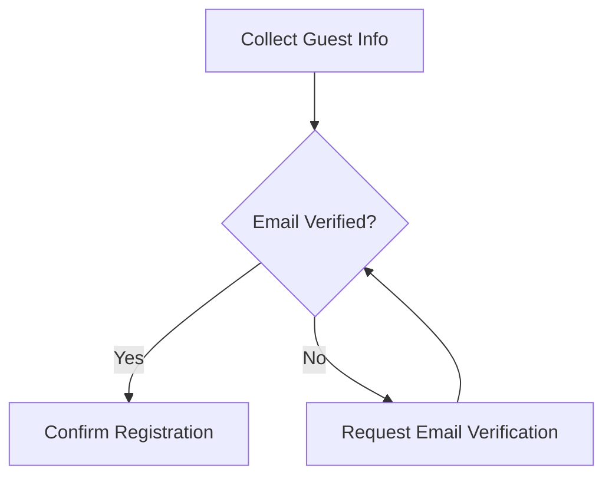

Interpretive State enables **fine-grained logical control** over interaction and decision-making by making state transitions explicit and inspectable.

## Control Capabilities

Interpretive State supports several advanced control patterns:

<CardGroup cols={2}>
  <Card title="Turn-Level State Diffs" icon="code-compare">
    Track what changed, when, and why at each conversation turn
  </Card>
  <Card title="Constraint Evaluation" icon="check-double">
    Monitor constraints as met, pending, or violated
  </Card>
  <Card title="Gated Transitions" icon="gate-and">
    Block or allow progress based on state conditions
  </Card>
  <Card title="Safe Partial Updates" icon="shield-check">
    Handle partial or invalid updates without corruption
  </Card>
</CardGroup>

## Example: State Diff Tracking

At each turn, Interpretive State can maintain explicit diffs:

```json
{
  "turn": 3,
  "changes": [
    {
      "field": "guests",
      "previous": ["wife"],
      "current": ["wife", "colleague"],
      "reason": "user_input",
      "confidence": 0.95
    }
  ],
  "constraints": {
    "max_guests": { "status": "met", "limit": 5, "current": 2 },
    "email_verified": { "status": "pending" }
  }
}
```

## Gated Transitions

Interpretive State can enforce logical gates that control conversation flow:



The gate conditions are explicitly represented in state:

```json
{
  "gates": {
    "can_confirm": {
      "requires": ["email_verified", "guests_valid", "date_confirmed"],
      "status": "blocked",
      "missing": ["email_verified"]
    }
  }
}
```

## Benefits of Explicit Control

| Hidden Logic | Explicit State |
|--------------|----------------|
| Rules embedded in prompts | Rules visible in state schema |
| Ad-hoc code paths | Declarative transitions |
| Difficult to test | Easily unit-tested |
| Opaque failures | Clear constraint violations |

By making these elements explicit in state, the system avoids hidden logic embedded in prompts or ad-hoc code paths. This leads to:

<Steps>
  <Step title="Predictability">
    State transitions follow declared rules, not implicit prompt behavior
  </Step>
  <Step title="Debuggability">
    Failed constraints clearly indicate what's blocking progress
  </Step>
  <Step title="Testability">
    Control logic can be tested independently of LLM behavior
  </Step>
  <Step title="Auditability">
    Full history of changes and reasons is preserved
  </Step>
</Steps>

Granular logical control transforms conversation systems from black boxes into transparent, inspectable state machines.
