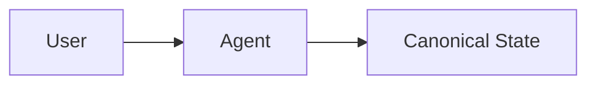

In conventional agentic application workflows, the system is typically designed around a **business-domain model** that represents the final artifact required by downstream processes. This model defines a fixed structure with a set of required fields, validation rules, and dependencies. The goal of the conversation is to progressively populate this structure until it is complete and valid.

This business-domain structure is commonly treated as the **Canonical State**. Conversation logic is then organized around filling the fields of this state, one by one, in an order that aligns with backend requirements. The implicit assumption is that successful interaction corresponds to gradually completing the Canonical State through dialogue.

## Conventional Architecture

In its simplest form, the conventional architecture can be illustrated as follows:

In this model, the Canonical State serves both as the authoritative business representation and as the primary interaction state.

## The Goal: Producing Structured Artifacts

In many agentic applications and workflows, the primary goal of conversation is to **produce a structured artifact** that feeds a downstream business process, such as:

- Creating an event for registration
- Submitting a tax return
- Configuring a service
- Completing an onboarding flow

In these systems, conversation is treated as a means to an end: collecting the required data to satisfy a predefined business schema. We refer to this finalized, validated, and business-facing artifact as the **Canonical State**.

## Emerging Challenges

As systems grow more capable, two related challenges emerge if the overall interaction architecture is not carefully designed.

### Challenge 1: Complex State and Long Sessions

As the underlying state structure becomes more complex or as conversation sessions become longer, it becomes increasingly difficult for canonical-only designs to correctly handle:

- **Order-independent field input** — users may provide information in any order
- **Ambiguity** — inputs may be unclear or require interpretation
- **Revisions** — users may change their mind or correct earlier inputs
- **Partial intent** — users may express incomplete thoughts

Even when not explicitly intended, systems may struggle to retain and reason over information provided out of order, or to reconcile multiple evolving interpretations without prematurely committing or discarding data.

### Challenge 2: Modern Interaction Patterns

Modern applications are often expected to support more effective interaction patterns beyond plain text, including:

- **Generative and interactive UI components**
- Robust **evaluation and inspection** of agent behavior

Supporting these requirements directly on top of a rigid canonical schema significantly increases design complexity, leading to tangled control logic and brittle edge-case handling.

## The Solution

Taken together, these challenges motivate the introduction of an additional interaction layer: the **Interpretive State**, allowing flexible conversation, richer UI modalities, and observable intermediate reasoning before information is finalized into Canonical State.
