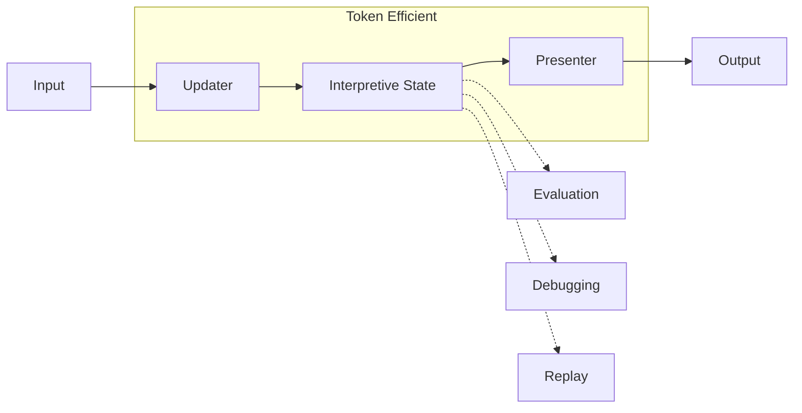

Interpretive State works in conjunction with the **[SUP (State–Updater–Presenter) pattern](/sup/sup)** to improve both runtime efficiency and evaluation quality.

## The Token Problem

In traditional conversational AI systems, maintaining context requires repeatedly passing conversation history to the LLM:

```
Turn 1: User says X → LLM processes X
Turn 2: User says Y → LLM processes X + Y  
Turn 3: User says Z → LLM processes X + Y + Z
...
Turn N: → LLM processes entire history
```

This leads to:
- **Linear token growth** with conversation length
- **Redundant processing** of unchanged information
- **Higher costs** and **slower responses**

## Externalized State Solution

By externalizing interaction state into Interpretive State, the pattern changes:

```
Turn 1: User says X → Update State → State v1
Turn 2: User says Y → Update State → State v2
Turn 3: User says Z → Update State → State v3
...
Turn N: LLM only needs Current State + Recent Input
```

<Info>
Prior context does not need to be repeatedly re-described to the LLM. The current Interpretive State **is** the context.
</Info>

## Benefits for Runtime

| Metric | Without Interpretive State | With Interpretive State |
|--------|---------------------------|------------------------|
| Token usage | O(n²) over conversation | O(1) per turn |
| Response latency | Increases with length | Constant |
| Cost per turn | Grows over time | Predictable |

## Benefits for Evaluation

Interpretive State enables powerful evaluation capabilities that are difficult or impossible with conversation-only systems:

<CardGroup cols={2}>
  <Card title="Replay" icon="rotate">
    State transitions can be replayed from any checkpoint
  </Card>
  <Card title="Inspect" icon="magnifying-glass">
    Examine exact state at any point in conversation
  </Card>
  <Card title="Compare" icon="code-compare">
    Diff states between runs or model versions
  </Card>
  <Card title="Test" icon="flask">
    Unit test state transitions without full conversations
  </Card>
</CardGroup>

### Evaluation Without Re-running

Traditional evaluation requires re-running full conversations:

```
Evaluate Turn 5 → Must replay Turns 1-4 first
```

With Interpretive State:

```
Evaluate Turn 5 → Load State v4, apply Turn 5 input, check result
```

This enables:
- **Targeted testing** of specific scenarios
- **Regression testing** with state snapshots
- **A/B comparison** of different updater implementations
- **Cost-effective evaluation** without burning tokens on replay

## Integration with SUP

The SUP pattern provides the structural framework, while Interpretive State provides the concrete substrate for efficient, testable interaction:



By combining SUP architecture with Interpretive State, teams achieve both runtime efficiency and comprehensive observability.
