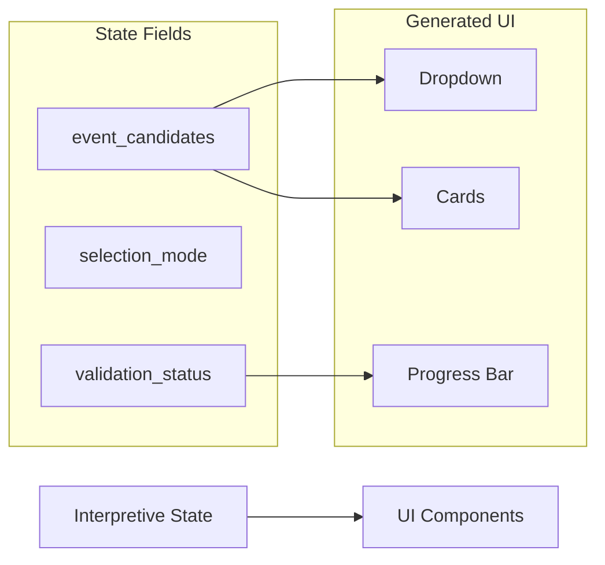
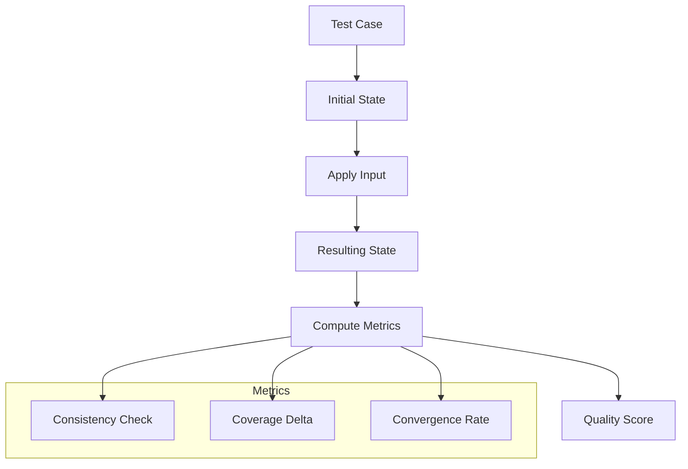

LangState's interpretive-first architecture enables three major capabilities that are difficult to achieve with traditional approaches.

## 1. Better Chat Flow Experience

Interpretive state transforms rigid, form-like interactions into natural conversations:

<Tabs>
  <Tab title="Without LangState">
    ```
    System: What is your email?
    User: I want to book for 3 people on Saturday
    System: Please provide your email first.
    User: john@example.com
    System: How many guests?
    User: I already said 3 people!
    ```
  </Tab>
  <Tab title="With LangState">
    ```
    System: What is your email?
    User: I want to book for 3 people on Saturday
    System: Got it — 3 guests for Saturday. 
            Just need your email to confirm.
    User: john@example.com
    System: Perfect! Confirming: 3 guests, Saturday,
            john@example.com. Ready to book?
    ```
  </Tab>
</Tabs>

**Key improvements**:
- Information is captured regardless of order
- Users aren't forced to repeat themselves
- The system acknowledges what it understood
- Natural flow rather than form-filling

---

## 2. Generative UI Support

Interpretive state provides a structured foundation for dynamic UI generation:



**State-to-component mapping**:

| State Property | UI Component |
|---------------|--------------|
| `candidates[]` with count < 5 | Radio buttons |
| `candidates[]` with count ≥ 5 | Searchable dropdown |
| `partial_values` | Editable form fields |
| `confidence` < threshold | Clarification prompt |
| `constraints.status` | Validation indicators |

**Example interpretive state**:
```json
{
  "event_selection": {
    "candidates": ["Summer Kickoff", "Team Retreat", "Q3 Review"],
    "display_hint": "card",
    "selected": null
  },
  "guest_count": {
    "value": 3,
    "editable": true,
    "constraints": { "min": 1, "max": 10 }
  }
}
```

This state directly drives UI rendering without additional mapping layers.

---

## 3. Prompt–State–Quality Evaluation

LangState enables a new evaluation paradigm based on state quality rather than output text:

<CardGroup cols={3}>
  <Card title="Consistency" icon="equals">
    Does state remain internally coherent across updates?
  </Card>
  <Card title="Coverage" icon="list-check">
    Are all required fields progressing toward completion?
  </Card>
  <Card title="Convergence" icon="bullseye">
    Is interpretive state stabilizing toward canonical form?
  </Card>
</CardGroup>

**Evaluation workflow**:



**Benefits over text-based evaluation**:

| Aspect | Text Evaluation | State Evaluation |
|--------|----------------|------------------|
| Objectivity | Subjective text matching | Structural comparison |
| Granularity | Whole response | Per-field metrics |
| Cost | Requires judge LLM | Deterministic checks |
| Reproducibility | Variable | Consistent |

**Example state quality check**:
```python
def evaluate_turn(state_before, input, state_after):
    return {
        "consistency": check_no_contradictions(state_after),
        "coverage": coverage_delta(state_before, state_after),
        "convergence": confidence_improvement(state_before, state_after),
        "regression": check_no_field_loss(state_before, state_after)
    }
```

---

## Summary

| Capability | Enabled By | Impact |
|------------|-----------|--------|
| Natural chat flow | Order-independent state capture | Better UX |
| Generative UI | Structured state-to-component mapping | Richer interfaces |
| Quality evaluation | Observable state transitions | Reliable improvement |

These capabilities emerge naturally from the interpretive-first architecture — they don't require additional infrastructure beyond the core state formation loop.
