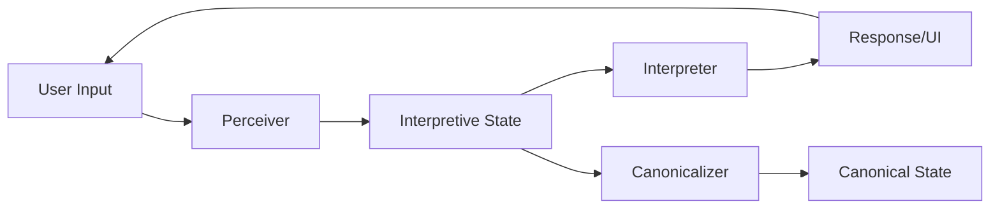

LangState introduces an **interpretive-first architecture** centered on the State Formation Loop. This design addresses the fundamental limitations of prompt-only systems when building real-world language-model applications.

## Motivation: Nonlinear Intent Formation

In real systems, users rarely express their intent in a clean, linear fashion. They may:

- Provide information out of order
- Change their mind mid-conversation
- Express partial or ambiguous intent
- Jump between topics and return later

Prompt-only systems struggle with this **nonlinear intent formation** because they lack a principled way to accumulate, revise, and stabilize meaning across turns.

## The State Formation Loop

LangState organizes interaction around a **State Formation Loop**:

The loop continuously:
1. **Perceives** user input (text, voice, UI interactions)
2. **Updates** interpretive state with new information
3. **Interprets** the current state to generate responses
4. **Canonicalizes** when interpretive state stabilizes

This creates a rhythm of **incremental accumulation** followed by **commitment**, rather than forcing premature decisions at each turn.

## Why Prompt-Only Systems Break Down

Traditional prompt-based systems face several structural limitations:

<CardGroup cols={2}>
  <Card title="Context Explosion" icon="explosion">
    Conversation history grows unbounded, increasing costs and latency
  </Card>
  <Card title="Lost Information" icon="trash">
    Earlier context gets dropped or summarized lossy
  </Card>
  <Card title="No Revision Model" icon="rotate-left">
    Changing earlier decisions requires awkward workarounds
  </Card>
  <Card title="Evaluation Difficulty" icon="chart-line">
    Hard to measure quality without structured intermediate state
  </Card>
</CardGroup>

By externalizing state and making the formation process explicit, LangState provides:

- **Bounded context**: Current state replaces unbounded history
- **Principled revision**: State fields can be updated individually
- **Observable progress**: Each turn produces measurable state changes
- **Structured evaluation**: Quality metrics can target specific state properties

## Core Insight

<Note>
The key insight is that **interpretive state** — a flexible, revision-tolerant representation of user intent — should be the primary substrate for interaction, not prompts or conversation history.
</Note>

Canonical state (the final business artifact) emerges from interpretive state through a well-defined reduction process, but the interaction layer operates on the richer interpretive representation.

This separation enables natural conversation, generative UI, and robust evaluation — capabilities that are difficult to achieve when working directly with prompts or canonical schemas.
