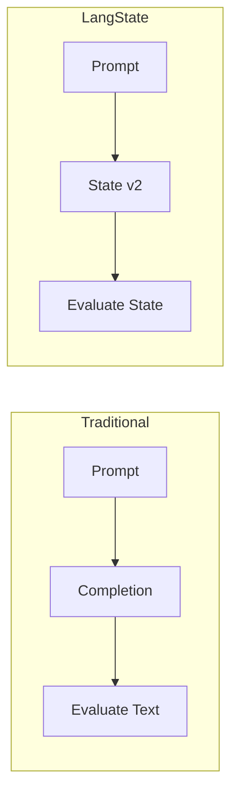

LangState addresses three fundamental problems that emerge when building production-grade language-model applications.

## Problem 1: Loss of Continuity Across Turns

In multi-turn conversations, traditional systems struggle to maintain coherent context:

```
Turn 1: User mentions preference A
Turn 5: User references "what I said earlier"
System: Cannot reliably connect to Turn 1
```

**The Issue**: Conversation history is an append-only log with no structured indexing. As conversations grow, relevant information becomes buried or truncated.

**LangState Solution**: Information is immediately captured in **interpretive state fields**. References to earlier input become lookups against structured state, not searches through conversation history.

```json
{
  "preferences": {
    "A": { "value": true, "source_turn": 1, "confidence": 0.95 }
  }
}
```

---

## Problem 2: Premature Commitment vs. Repeated Re-inference

Systems face a difficult tradeoff:

<Tabs>
  <Tab title="Commit Early">
    ```
    User: "I'm thinking Saturday"
    System: ✓ Commits date = Saturday
    User: "Actually, maybe Sunday works better"
    System: ✗ Must undo committed state
    ```
    
    **Risk**: Locking in values too early leads to brittle interactions and complex undo logic.
  </Tab>
  <Tab title="Commit Late">
    ```
    User: "I'm thinking Saturday"
    System: Does not commit
    ...5 turns later...
    User: "So for Saturday..."
    System: Re-infers date from history
    ```
    
    **Risk**: Re-inferring from history wastes tokens and risks inconsistent interpretation.
  </Tab>
</Tabs>

**LangState Solution**: Interpretive state holds **tentative values** with explicit confidence and status:

```json
{
  "date": {
    "value": "Saturday",
    "status": "tentative",
    "alternatives": ["Sunday"],
    "confidence": 0.7
  }
}
```

Values are captured immediately but only **canonicalized** when stable. This eliminates both premature commitment and redundant re-inference.

---

## Problem 3: Evaluation Fragility

Prompt–completion evaluation faces structural challenges:

| Challenge | Description |
|-----------|-------------|
| **Surface matching** | Comparing text outputs misses semantic equivalence |
| **Turn coupling** | Can't evaluate Turn 5 without replaying Turns 1-4 |
| **Hidden state** | No visibility into what the system "believes" |
| **Non-reproducibility** | Same input may produce different valid outputs |

**LangState Solution**: Evaluation shifts from **prompt–completion pairs** to **prompt–state pairs**:



Benefits:
- **Structural comparison**: Compare state objects, not text
- **Turn isolation**: Load state snapshot, apply single turn, check result
- **Observable beliefs**: State explicitly represents system understanding
- **Deterministic diffing**: State changes are well-defined and comparable

---

## Summary

| Problem | Traditional Approach | LangState Approach |
|---------|---------------------|-------------------|
| Continuity | Search conversation history | Query structured state |
| Commitment timing | Commit early or re-infer | Tentative until canonicalized |
| Evaluation | Text-to-text comparison | State-to-state comparison |

By making state explicit and separating interpretation from commitment, LangState provides a principled foundation for building robust conversational systems.
