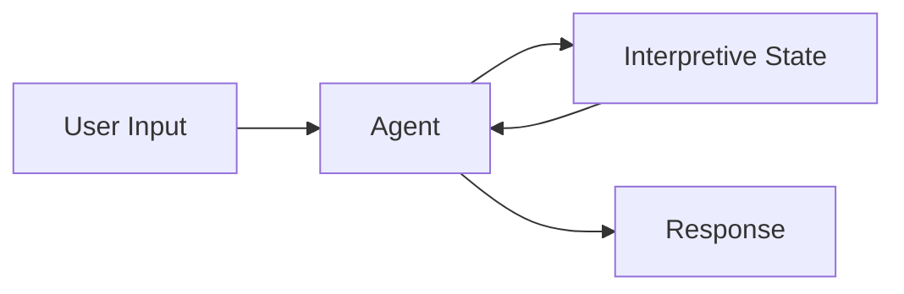
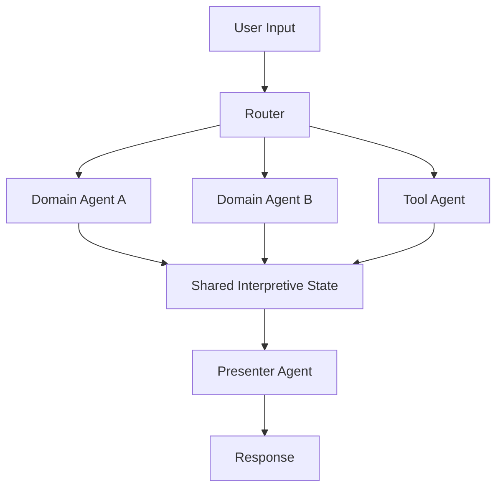
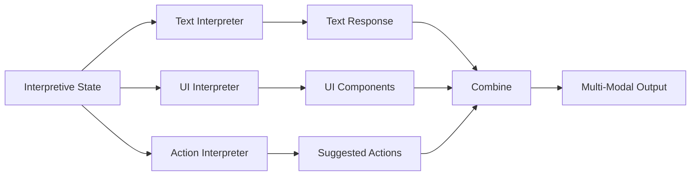
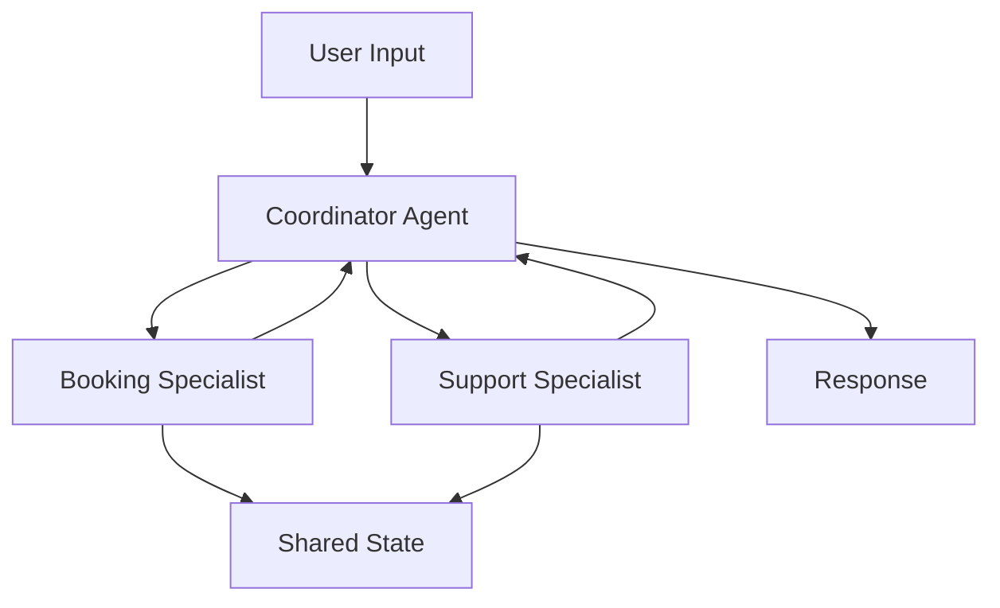
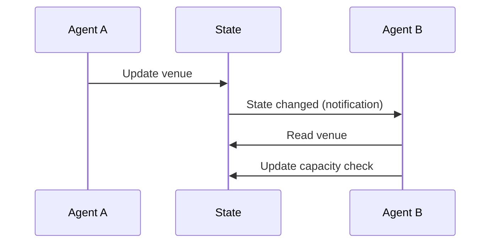
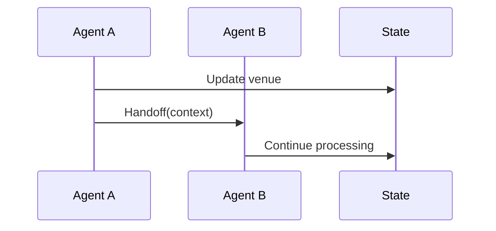

LangState supports various agent composition patterns, from simple single-agent systems to complex multi-agent architectures.

## Single-Agent Architecture

The simplest architecture: one agent handles the entire state formation loop.



### When to Use

- Simple, focused tasks
- Single domain of expertise
- Straightforward state schema
- Limited tool requirements

### Implementation

```python
class SingleAgent:
    def __init__(self, perceiver, interpreter, state_schema):
        self.perceiver = perceiver
        self.interpreter = interpreter
        self.state = InterpretiveState(state_schema)
    
    def process(self, user_input):
        # Perceive input
        update = self.perceiver.perceive(user_input, self.state)
        
        # Update state
        self.state.apply(update)
        
        # Generate response
        response = self.interpreter.interpret(self.state)
        
        return response
```

---

## Multi-Agent Architecture

Multiple specialized agents collaborate around shared state.



### When to Use

- Complex multi-domain tasks
- Specialized expertise required
- Large or composite state schemas
- Heavy tool usage

### Agent Roles

| Agent Type | Responsibility | Example |
|------------|---------------|---------|
| **Router** | Direct input to appropriate agent | Intent classification |
| **Domain Agent** | Handle specific domain updates | Booking agent, Support agent |
| **Tool Agent** | Execute tools and integrate results | API calls, searches |
| **Presenter** | Generate user-facing responses | Response formatting |

---

## Parallel Interpreters

Multiple interpreters react to the same state simultaneously.



### Benefits

- Specialized output generation per modality
- Parallel processing for lower latency
- Independent evolution of each interpreter

### Implementation

```python
class ParallelInterpreters:
    def __init__(self, interpreters):
        self.interpreters = interpreters  # {name: interpreter}
    
    def interpret(self, state):
        # Run interpreters in parallel
        results = parallel_map(
            lambda name, interp: (name, interp.interpret(state)),
            self.interpreters.items()
        )
        
        return MultiModalResponse(dict(results))
```

---

## Hierarchical Agent Pattern

Agents organized in a hierarchy with delegation.



### Coordinator Role

```python
class CoordinatorAgent:
    def __init__(self, specialists):
        self.specialists = specialists
    
    def process(self, user_input, state):
        # Determine which specialist(s) to invoke
        relevant = self.route(user_input, state)
        
        # Delegate to specialists
        results = []
        for specialist in relevant:
            result = specialist.process(user_input, state)
            results.append(result)
        
        # Synthesize responses
        return self.synthesize(results, state)
    
    def route(self, user_input, state):
        # Classify intent and current state to select specialists
        intent = classify_intent(user_input)
        active_domain = state.get_active_domain()
        
        return [s for s in self.specialists 
                if s.handles(intent, active_domain)]
```

---

## State Partitioning

For complex states, partition across agents:

```json
{
  "booking": {
    // Managed by Booking Agent
    "venue": {...},
    "date": {...}
  },
  "support": {
    // Managed by Support Agent
    "issue": {...},
    "history": {...}
  },
  "shared": {
    // Accessible to all
    "user_profile": {...},
    "preferences": {...}
  }
}
```

### Partition Rules

| Partition | Access | Owner |
|-----------|--------|-------|
| Domain-specific | Read/Write by domain agent | Domain agent |
| Shared | Read by all, Write coordinated | Coordinator |
| Meta | System-managed | Framework |

---

## Agent Communication Patterns

### Pattern 1: State-Mediated

Agents communicate only through state:



**Pros**: Loose coupling, clear contracts  
**Cons**: May miss nuanced coordination needs

### Pattern 2: Direct Handoff

Agents pass control explicitly:



**Pros**: Explicit control flow, context passing  
**Cons**: Tighter coupling

### Pattern 3: Event-Driven

Agents respond to state events:

```python
class EventDrivenAgent:
    def __init__(self):
        self.handlers = {}
    
    def on(self, event_type, handler):
        self.handlers[event_type] = handler
    
    def handle_event(self, event, state):
        if event.type in self.handlers:
            return self.handlers[event.type](event, state)
```

---

## Choosing a Pattern

| Factor | Single Agent | Multi-Agent | Hierarchical |
|--------|--------------|-------------|--------------|
| Task complexity | Simple | Complex | Very complex |
| Domain count | 1 | 2-5 | 5+ |
| State size | Small | Medium | Large |
| Latency requirement | Low | Medium | Higher |
| Development effort | Low | Medium | High |

---

## Best Practices

<CardGroup cols={2}>
  <Card title="Start Simple" icon="seedling">
    Begin with single agent, add complexity as needed
  </Card>
  <Card title="State as Contract" icon="file-contract">
    Use state schema as the API between agents
  </Card>
  <Card title="Clear Boundaries" icon="border-all">
    Define what each agent owns and can modify
  </Card>
  <Card title="Monitor Handoffs" icon="eye">
    Log and track agent-to-agent transitions
  </Card>
</CardGroup>
