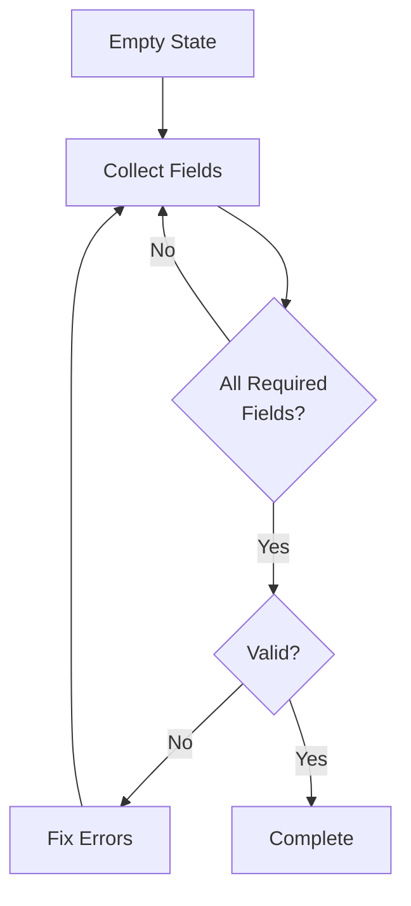
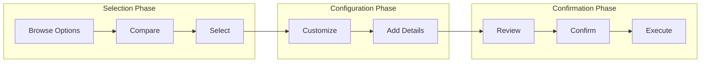
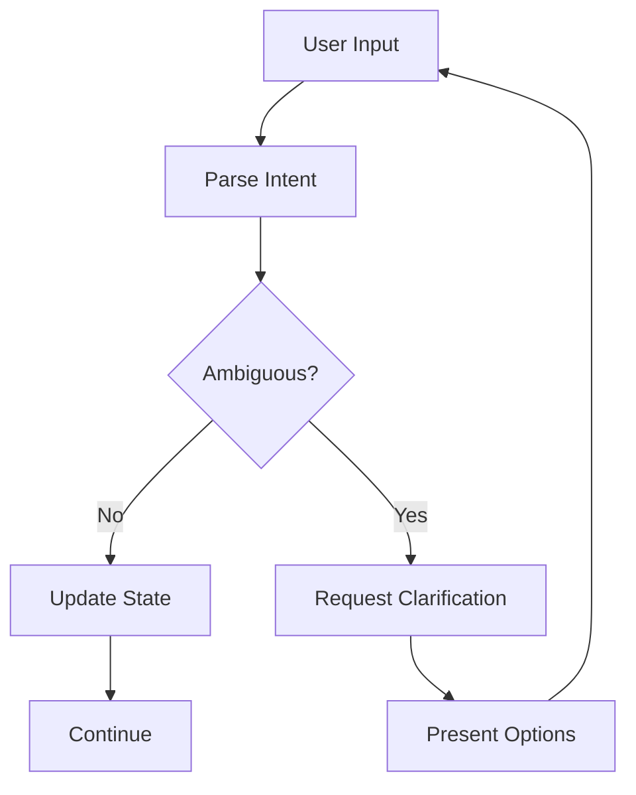
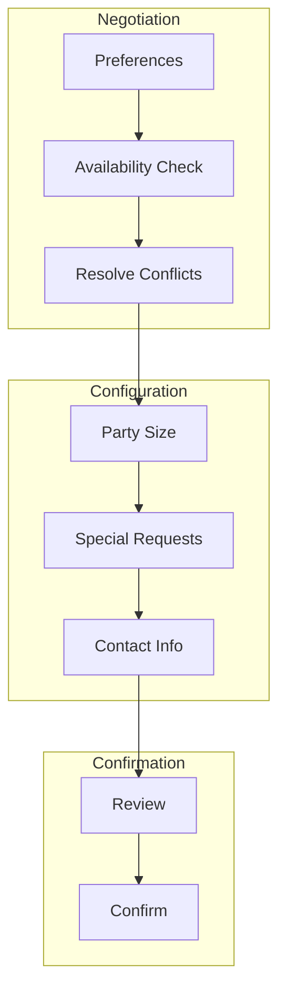

LangState naturally supports common interaction patterns. This section describes patterns that emerge frequently in state-based systems.

## Form Filling Pattern

The most basic pattern: progressively collecting structured data.



### State Structure

```json
{
  "form": {
    "fields": {
      "name": { "value": "John", "status": "confirmed" },
      "email": { "value": null, "status": "pending" },
      "phone": { "value": null, "status": "pending" }
    },
    "validation": {
      "errors": [],
      "warnings": []
    },
    "progress": {
      "required_count": 3,
      "filled_count": 1,
      "percentage": 33
    }
  }
}
```

### Interpreter Response Strategy

```python
def interpret_form_state(state):
    if state.form.validation.errors:
        return prompt_fix_errors(state.form.validation.errors)
    
    pending = [f for f in state.form.fields if f.status == "pending"]
    if pending:
        # Ask for next most important pending field
        next_field = prioritize_fields(pending)[0]
        return prompt_for_field(next_field)
    
    return prompt_confirmation(state)
```

---

## Booking and Configuration Pattern

For multi-step reservations, configurations, or orders.



### State Structure

```json
{
  "booking": {
    "phase": "selection",
    
    "selection": {
      "category": { "value": "venue", "status": "confirmed" },
      "candidates": [
        { "id": "v1", "name": "Hall A", "score": 0.9 },
        { "id": "v2", "name": "Hall B", "score": 0.7 }
      ],
      "selected": null
    },
    
    "configuration": {
      "date": { "value": null, "status": "pending" },
      "time": { "value": null, "status": "pending" },
      "guests": { "value": null, "status": "pending" }
    },
    
    "confirmation": {
      "reviewed": false,
      "confirmed": false
    }
  }
}
```

### Phase Transitions

```python
def determine_phase(state):
    if not state.booking.selection.selected:
        return "selection"
    
    config = state.booking.configuration
    required_config = ["date", "time", "guests"]
    if not all(config[f].status == "confirmed" for f in required_config):
        return "configuration"
    
    if not state.booking.confirmation.confirmed:
        return "confirmation"
    
    return "complete"
```

---

## Negotiation and Clarification Pattern

For handling ambiguity and reaching mutual understanding.



### State Structure

```json
{
  "negotiation": {
    "topic": "date_selection",
    "status": "clarifying",
    
    "user_input": "sometime next week",
    "interpretations": [
      { "value": "2024-03-18", "label": "Monday", "confidence": 0.3 },
      { "value": "2024-03-20", "label": "Wednesday", "confidence": 0.4 },
      { "value": "2024-03-22", "label": "Friday", "confidence": 0.3 }
    ],
    
    "clarification": {
      "question": "Which day next week works best?",
      "options_shown": true,
      "attempts": 1
    }
  }
}
```

### Clarification Strategy

```python
def handle_ambiguity(state, interpretations):
    if len(interpretations) == 1 and interpretations[0].confidence > 0.9:
        # High confidence single interpretation - accept
        return accept_interpretation(interpretations[0])
    
    if len(interpretations) <= 3:
        # Few options - present as buttons
        return present_options(interpretations)
    
    if len(interpretations) <= 10:
        # Medium options - present as list
        return present_list(interpretations)
    
    # Many options - ask for narrowing
    return request_more_specific()
```

### Multi-Round Clarification

```
Turn 1: "Book for next week"
→ Clarify: "Which day?"
→ Options: [Mon] [Tue] [Wed] [Thu] [Fri]

Turn 2: "Probably mid-week"
→ Narrowed: [Tue] [Wed] [Thu]
→ Clarify: "Tuesday, Wednesday, or Thursday?"

Turn 3: "Wednesday"
→ Resolved: date = Wednesday
```

---

## Pattern Combinations

Real applications often combine patterns:

### Example: Restaurant Booking



### State for Combined Flow

```json
{
  "restaurant_booking": {
    "negotiation": {
      "cuisine": { "value": "Italian", "status": "confirmed" },
      "date": { 
        "preferred": "Friday",
        "available": ["Saturday"],
        "status": "negotiating"
      },
      "resolved": false
    },
    
    "configuration": {
      "party_size": { "value": 4, "status": "confirmed" },
      "dietary": { "value": ["vegetarian"], "status": "confirmed" },
      "occasion": { "value": null, "status": "optional" }
    },
    
    "contact": {
      "name": { "value": "John", "status": "confirmed" },
      "phone": { "value": null, "status": "pending" }
    },
    
    "overall_phase": "negotiation"
  }
}
```

---

## Pattern Selection Guide

| Scenario | Primary Pattern | Secondary Pattern |
|----------|-----------------|-------------------|
| Simple data collection | Form Filling | — |
| Product selection + purchase | Booking | Form Filling |
| Preference elicitation | Clarification | Negotiation |
| Complex configuration | Booking | Negotiation |
| Support ticket creation | Form Filling | Clarification |
| Travel planning | All three | — |

---

## Best Practices

<CardGroup cols={2}>
  <Card title="Match Pattern to Task" icon="puzzle-piece">
    Choose the pattern that fits the interaction complexity
  </Card>
  <Card title="Allow Pattern Switching" icon="shuffle">
    Users may jump between patterns naturally
  </Card>
  <Card title="Track Phase" icon="map">
    Explicitly track which phase/pattern is active
  </Card>
  <Card title="Design for Partial" icon="circle-half-stroke">
    Each pattern should handle incomplete state gracefully
  </Card>
</CardGroup>
